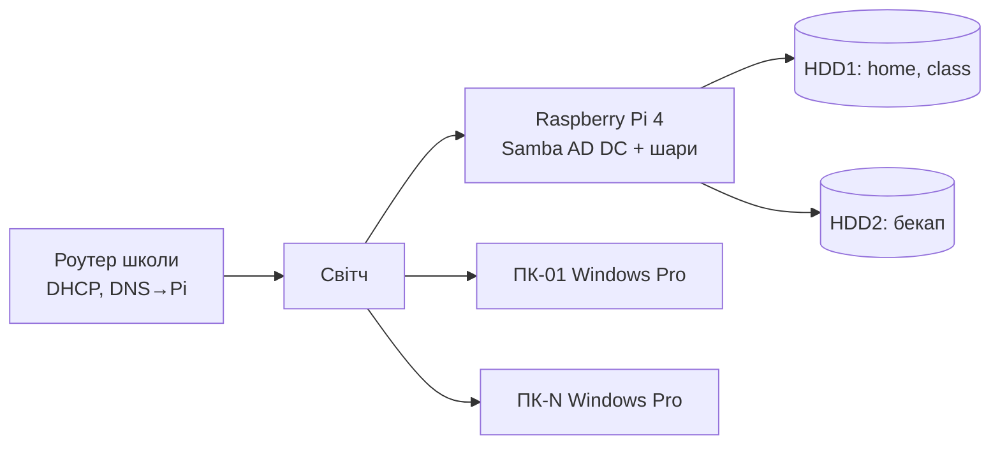

# Впровадження комп'ютерного класу: Samba AD DC на Raspberry Pi 4 + Windows Pro

2026-09-24 · Viktor

> Зміни, ухвалені в плані застосунку (`docs/plan.md`, розділ «Розгортання на Pi → Що змінюється в інструкції впровадження»), мають пріоритет над цим документом: `submit\<login>\` — підпапка на учня; Trusted Root CA і ярлик «Роздатки» у GPO; `backup.sh` копіює `/var/lib/scm`.

## Архітектура і передумови

Результат: кожен учень входить у Windows під своїм логіном на будь-якому ПК класу; його «Робочий стіл» і «Документи» лежать на Raspberry Pi; на самому ПК він нічого змінити не може. Оцінка трудомісткості — 5 робочих днів, з них 2 дні на еталонний ПК і політики.



Усі ПК і Pi в одній підмережі; Pi — єдиний DNS для ПК, роутер лишається шлюзом і DHCP-сервером.

### Що потрібно мати до старту

| Компонент | Вимога | Навіщо |
| --- | --- | --- |
| Raspberry Pi 4 | 4 GB RAM або більше, живлення 5 V/3 A, Ethernet-кабель до світча | DC + файловий сервер |
| USB SSD | 64 GB+, USB 3.0 | система Pi; SD-карта не підходить під постійний запис |
| USB3-бокс із живленням | 2 слоти або 2 окремих боки | Pi не витягне HDD по живленню з USB |
| Старі HDD | 2 шт., перевірені `smartctl` | HDD1 — дані, HDD2 — бекап |
| UPS | 300–600 VA, на Pi + світч | логін з кешу переживе, файли — ні |
| Роутер | можливість задати DNS-опцію в DHCP | інакше DHCP переносимо на Pi |
| ПК учнів | Windows 10/11 **Pro**, ~8 GB RAM, SSD | Home домен не вміє |
| Ваш ноутбук/ПК | Windows Pro у домені або на Mac — Windows у VM | RSAT: GPMC + ADUC |
| Флешка 8 GB+ | Clonezilla Live | тиражування образу |

### Рішення, які фіксуємо зараз

| Параметр | Значення | Коментар |
| --- | --- | --- |
| Realm (DNS-домен AD) | `ad.school.lan` | не `.local` — конфліктує з mDNS; краще піддомен реального домену школи, якщо є |
| NetBIOS-ім'я | `SCHOOL` | що бачать учні у вікні входу |
| Ім'я Pi | `dc1` → `dc1.ad.school.lan` | статична IP, напр. `192.168.1.2` |
| Імена ПК | `KAB-01` … `KAB-15` | наліпка на корпусі з тим самим номером |
| Логіни учнів | `4a.prizvyshche` | латиниця, клас у логіні — видно, хто де |
| Групи | `uchni`, `uchni-3a`, `uchni-4a`, `vchyteli` | права — тільки по групах |
| OU | `Uchni`, `Vchyteli`, `Klas-PC` | політики вішаємо на OU, не на домен |

- [ ] Перевірити редакцію Windows на кожному ПК: `winver` або `Get-ComputerInfo | select WindowsProductName`
- [ ] Перевірити HDD: `sudo smartctl -a /dev/sda | grep -E 'Reallocated|Pending|Power_On'`
- [ ] Домовитись із адміністрацією про пароль локального адміна ПК і пароль `Administrator` домену — знаєте тільки ви + конверт у сейфі директора

## Етап 1. Підготовка Raspberry Pi (½ дня)

На виході: Pi завантажується з USB SSD, має статичну IP, точний час, обидва HDD змонтовані, на HDD1 — btrfs із підтомами під дані.

1. **Записати систему на SSD.** Raspberry Pi Imager → Raspberry Pi OS Lite (64-bit). У налаштуваннях Imager: hostname `dc1`, користувач `admin` з вашим SSH-ключем, SSH увімкнено, Wi-Fi вимкнено, локаль `Europe/Kyiv`.
2. **Увімкнути завантаження з USB.** Завантажитись із будь-якої SD-карти, потім:
    ```bash
    sudo rpi-eeprom-update -a && sudo reboot
    sudo raspi-config   # Advanced Options → Boot Order → USB Boot
    ```
    Вимкнути Pi, витягти SD, підключити SSD, увімкнути. Далі все по SSH.
3. **Оновити систему і поставити базу.**
    ```bash
    sudo apt update && sudo apt full-upgrade -y
    sudo apt install -y btrfs-progs smartmontools chrony rsync vim nftables
    ```
4. **Статична IP.** Raspberry Pi OS (bookworm) використовує NetworkManager:
    ```bash
    sudo nmcli con mod "Wired connection 1" ipv4.method manual \
      ipv4.addresses 192.168.1.2/24 ipv4.gateway 192.168.1.1 \
      ipv4.dns 127.0.0.1 ipv4.dns-search ad.school.lan
    sudo nmcli con up "Wired connection 1"
    ```
    У `/etc/hosts` додати рядок `192.168.1.2 dc1.ad.school.lan dc1`. Перевірка: `hostname -f` → `dc1.ad.school.lan`.
5. **Час.** Kerberos не працює при розбіжності понад 5 хв. У `/etc/chrony/chrony.conf` додати наприкінці (сокет з'явиться після встановлення Samba):
    ```
    allow 192.168.1.0/24
    ntpsigndsocket /var/lib/samba/ntp_signd/
    ```
    Після Етапу 2: `sudo chown root:_chrony /var/lib/samba/ntp_signd && sudo chmod 750 /var/lib/samba/ntp_signd && sudo systemctl restart chrony`.
6. **Диски.** Визначити пристрої: `lsblk -o NAME,SIZE,MODEL,SERIAL`. HDD1 = дані, HDD2 = бекап.
    ```bash
    sudo mkfs.btrfs -L data /dev/sda
    sudo mkfs.btrfs -L backup /dev/sdb
    sudo mkdir -p /srv/data /srv/backup
    sudo mount /dev/sda /srv/data
    sudo btrfs subvolume create /srv/data/home
    sudo btrfs subvolume create /srv/data/class
    sudo btrfs subvolume create /srv/data/ad-backup
    sudo mkdir -p /srv/data/home/.snapshots /srv/data/class/.snapshots
    ```
    У `/etc/fstab` — за UUID (`blkid`), щоб не залежати від порядку USB:
    ```
    UUID=<uuid-data>   /srv/data   btrfs  defaults,noatime,nofail,x-systemd.device-timeout=30  0 0
    UUID=<uuid-backup> /srv/backup btrfs  defaults,noatime,nofail,x-systemd.device-timeout=30  0 0
    ```
    `nofail` обов'язково: без нього Pi не завантажиться, якщо бокс не встиг увімкнутись.
7. **Перевірити після перезавантаження.** `sudo reboot`, потім `df -h /srv/data /srv/backup`, `chronyc tracking`, `ping -c1 8.8.8.8`.

Не робити RAID зі старих HDD: два старі диски в mirror — це подвійний шанс отримати помилку в незрозумілому стані. Один працює, другий отримує нічну копію.

## Етап 2. Samba AD DC (½ дня)

На виході: домен `ad.school.lan` піднято, DNS відповідає на SRV-записи, `kinit` працює, Pi роздає підписаний NTP.

1. **Встановити пакети.** Під час встановлення пакет `krb5-config` запитає realm — ввести `AD.SCHOOL.LAN` (великими).
    ```bash
    sudo apt install -y samba samba-dsdb-modules samba-vfs-modules \
      winbind libpam-winbind libnss-winbind krb5-user krb5-config \
      ldb-tools acl
    ```
2. **Вимкнути звичайні сервіси Samba** — DC працює як окремий юніт:
    ```bash
    sudo systemctl disable --now smbd nmbd winbind
    sudo systemctl unmask samba-ad-dc
    sudo mv /etc/samba/smb.conf /etc/samba/smb.conf.orig
    ```
3. **Provision.** Пароль Administrator — 12+ символів, записати в конверт.
    ```bash
    sudo samba-tool domain provision --use-rfc2307 --interactive
    ```
    Відповіді: Realm `AD.SCHOOL.LAN`, Domain `SCHOOL`, Server Role `dc`, DNS backend `SAMBA_INTERNAL`, DNS forwarder — IP роутера (`192.168.1.1`) або `8.8.8.8`.
4. **Kerberos і DNS.**
    ```bash
    sudo cp /var/lib/samba/private/krb5.conf /etc/krb5.conf
    sudo systemctl enable --now samba-ad-dc
    ```
    Перевірити, що `/etc/resolv.conf` містить `nameserver 127.0.0.1` і `search ad.school.lan` (nmcli з Етапу 1 це зробив). Якщо в системі є `systemd-resolved` — вимкнути: `sudo systemctl disable --now systemd-resolved`.
5. **NTP.** Виконати команди для `ntp_signd` з Етапу 1 п. 5.
6. **Перевірки** — усі мають пройти, інакше не йти далі:
    ```bash
    sudo samba-tool domain level show
    host -t SRV _ldap._tcp.ad.school.lan     # → dc1.ad.school.lan
    host -t SRV _kerberos._udp.ad.school.lan
    host -t A dc1.ad.school.lan
    kinit administrator && klist               # квиток Kerberos
    smbclient -L localhost -N                  # бачимо netlogon, sysvol
    smbclient //localhost/netlogon -U administrator -c 'ls'
    ```
7. **Базовий `smb.conf`** — `/etc/samba/smb.conf` після provision. Додати в `[global]` і залишити секції `netlogon`/`sysvol` як є:
    ```ini
    [global]
        # ... згенероване provision ...
        dns forwarder = 192.168.1.1
        template shell = /bin/false
        idmap_ldb:use rfc2307 = yes
        # адміну можна бачити файли з Linux
        winbind enum users = yes
        winbind enum groups = yes
    ```
    `sudo systemctl restart samba-ad-dc`, потім `sudo samba-tool testparm`.
8. **Резервна копія «чистого» домену** — до того, як щось зламали:
    ```bash
    sudo samba-tool domain backup offline --targetdir=/srv/data/ad-backup
    ```

DHCP на роутері: виставити DNS-сервер = `192.168.1.2`, домен = `ad.school.lan`. Якщо роутер не дає змінити DNS-опцію — вимкнути на ньому DHCP і підняти `isc-dhcp-server` на Pi (10 хвилин, окрема інструкція за потреби). Без DNS через Pi жоден ПК у домен не зайде.

## Етап 3. Файлові шари й права (½ дня)

На виході: три шари на Pi; учень має RW лише у власній папці `home`, RO у `handouts`, RW лише у своїй підпапці `submit\<login>\`; вчитель бачить усе.

Права на файли задаються **з Windows** (вкладка «Безпека» під `SCHOOL\Administrator`), а не `chmod`/`setfacl` — так ACL збігаються з тим, що очікує Folder Redirection, і їх видно у звичному інтерфейсі. Тому шари створюються тут, а права виставляються після Етапу 5 (коли є Windows-машина в домені).

1. **Секції шар у `/etc/samba/smb.conf`:**
    ```ini
    [home]
        path = /srv/data/home
        read only = no
        browseable = yes
        hide unreadable = yes
        vfs objects = dfs_samba4 acl_xattr shadow_copy2
        shadow:snapdir = .snapshots
        shadow:sort = desc
        shadow:format = @GMT-%Y.%m.%d-%H.%M.%S

    [class]
        path = /srv/data/class
        read only = no
        browseable = yes
        vfs objects = dfs_samba4 acl_xattr shadow_copy2
        shadow:snapdir = .snapshots
        shadow:sort = desc
        shadow:format = @GMT-%Y.%m.%d-%H.%M.%S
    ```
    `sudo samba-tool testparm && sudo systemctl restart samba-ad-dc`.
2. **Структура папок:**
    ```bash
    sudo mkdir -p /srv/data/class/{3a,4a}/{handouts,submit}
    sudo chown -R root:root /srv/data/home /srv/data/class
    sudo chmod 755 /srv/data/home /srv/data/class
    ```
3. **ACL (з Windows, після Етапу 5).** `Win+R` → `\\dc1\home` → ПКМ → Властивості → Безпека → Додатково. Зняти успадкування, видалити все, задати:

| Папка | Кому | Права | Область |
| --- | --- | --- | --- |
| `home` | `Domain Admins`, `SYSTEM` | Повний доступ | ця папка, підпапки, файли |
| `home` | `vchyteli` | Повний доступ | ця папка, підпапки, файли |
| `home` | `uchni` | Перегляд списку + Створення папок | тільки ця папка |
| `home` | `CREATOR OWNER` | Повний доступ | тільки підпапки й файли |
| `class\<клас>\handouts` | `vchyteli` | Зміна | ця папка, підпапки, файли |
| `class\<клас>\handouts` | `uchni-<клас>` | Читання й виконання | ця папка, підпапки, файли |
| `class\<клас>\submit` | `vchyteli` | Повний доступ | ця папка, підпапки, файли |
| `class\<клас>\submit` | `uchni-<клас>` | Перегляд списку | тільки ця папка |
| `class\<клас>\submit\<login>` | `<login>` | Зміна | ця папка, підпапки, файли (створює logon-скрипт, Етап 8) |

Логіка `home`: учень може створити папку в корені (це робить Folder Redirection при першому вході), стає її власником і через `CREATOR OWNER` отримує повний доступ лише до неї. Чужі папки він не бачить навіть у списку (`hide unreadable = yes`).

Логіка `submit`: підпапку `submit\<login>` створює GPO logon-скрипт при першому вході й дає учню права на неї; учень бачить тільки свою. Вчитель бачить усе. Застосунок School Class Manager визначає «хто не здав» за назвами підпапок.

4. **Перевірка з Linux** (після створення тестового учня в Етапі 6):
    ```bash
    smbclient //dc1/home -U '4a.test' -c 'mkdir 4a.test; cd 4a.test; put /etc/hostname'
    smbclient //dc1/class -U '4a.test' -c 'cd 4a/handouts; put /etc/hostname'   # має відмовити
    ```

## Етап 4. Снапшоти й резервне копіювання (2 години)

На виході: снапшоти `home`/`class` щогодини в робочий час, видимі у Windows як «Попередні версії»; нічний rsync на HDD2; щотижневий бекап бази AD.

1. **Скрипт снапшотів** `/usr/local/sbin/snap.sh` (готовий у `pi/sbin/snap.sh`):
    ```bash
    #!/bin/bash
    set -e
    ts=$(date -u +@GMT-%Y.%m.%d-%H.%M.%S)
    for v in home class; do
      btrfs subvolume snapshot -r /srv/data/$v /srv/data/$v/.snapshots/$ts
      # тримаємо 30 днів
      find /srv/data/$v/.snapshots -maxdepth 1 -name '@GMT-*' -mtime +30 \
        -exec btrfs subvolume delete {} \;
    done
    ```
    `sudo chmod +x /usr/local/sbin/snap.sh`. Формат імені має точно збігатись із `shadow:format` в `smb.conf` — тоді у Windows на папці учня з'являється вкладка «Попередні версії».
2. **Скрипт бекапу** `/usr/local/sbin/backup.sh` (готовий у `pi/sbin/backup.sh`):
    ```bash
    #!/bin/bash
    set -e
    rsync -a --delete --exclude='.snapshots' /srv/data/home/  /srv/backup/home/
    rsync -a --delete --exclude='.snapshots' /srv/data/class/ /srv/backup/class/
    rsync -a --delete /var/lib/scm/ /srv/backup/scm/ 2>/dev/null || true
    rsync -a --delete /etc/scm/     /srv/backup/scm-etc/ 2>/dev/null || true
    # база AD раз на тиждень, у неділю
    if [ "$(date +%u)" = 7 ]; then
      rm -rf /srv/data/ad-backup/*
      samba-tool domain backup offline --targetdir=/srv/data/ad-backup
      rsync -a --delete /srv/data/ad-backup/ /srv/backup/ad-backup/
    fi
    ```
3. **Розклад** — `sudo crontab -e`:
    ```
    0 8-17 * * 1-5  /usr/local/sbin/snap.sh   >> /var/log/snap.log 2>&1
    30 22  * * *    /usr/local/sbin/backup.sh >> /var/log/backup.log 2>&1
    ```
4. **Перевірка**: запустити `snap.sh` вручну, у Windows на `\\dc1\home\<учень>` → Властивості → Попередні версії — має бути запис. Запустити `backup.sh`, порівняти `du -sh /srv/data/home /srv/backup/home`.
5. **Образ системного SSD Pi** — раз після завершення впровадження і після кожної суттєвої зміни: вимкнути Pi, підключити SSD до Mac, `sudo dd if=/dev/rdiskN bs=4m | gzip > pi-dc1-$(date +%F).img.gz`. Це відновлення Pi за 20 хвилин замість дня.

Бекап не перевірений — не бекап. Раз на семестр: витягнути HDD2, підключити до Mac/Linux, відкрити папку випадкового учня.

## Етап 5. Робоче місце адміністратора (1 година)

На виході: одна Windows Pro-машина в домені з RSAT, з якої редагуються GPO і права на папки. Це може бути перший ПК класу (`KAB-01`) — він же стане еталоном в Етапі 7.

1. **Підготувати ПК.** Перейменувати: Параметри → Система → Про систему → Перейменувати цей ПК → `KAB-01`, перезавантажити. Перевірити, що DNS дивиться на Pi: `nslookup dc1.ad.school.lan` → `192.168.1.2`. Час: `w32tm /resync` після join.
2. **Ввести в домен.** PowerShell від адміністратора:
    ```powershell
    Add-Computer -DomainName ad.school.lan -Credential SCHOOL\Administrator -Restart
    ```
    Або Параметри → Система → Про систему → Домен або робоча група. Після перезавантаження увійти як `SCHOOL\Administrator`.
3. **Встановити RSAT.** PowerShell від адміністратора:
    ```powershell
    Add-WindowsCapability -Online -Name Rsat.ActiveDirectory.DS-LDS.Tools~~~~0.0.1.0
    Add-WindowsCapability -Online -Name Rsat.GroupPolicy.Management.Tools~~~~0.0.1.0
    Add-WindowsCapability -Online -Name Rsat.Dns.Tools~~~~0.0.1.0
    ```
    Потребує інтернету; інколи блокується політикою WSUS — тоді Параметри → Програми → Додаткові компоненти → RSAT: … вручну.
4. **Перевірити інструменти.** `dsa.msc` (Active Directory — користувачі й комп'ютери) має показати домен; `gpmc.msc` — Default Domain Policy; `dnsmgmt.msc` — зону `ad.school.lan`.
5. **Виставити ACL на шари** за таблицею з Етапу 3.
6. **Central Store для ADMX** — щоб політики Chrome і сучасних Windows редагувались з будь-якої машини:
    ```powershell
    $dst = "\\ad.school.lan\SYSVOL\ad.school.lan\Policies\PolicyDefinitions"
    Copy-Item C:\Windows\PolicyDefinitions $dst -Recurse
    ```
    Завантажити [Chrome Enterprise policy templates](https://chromeenterprise.google/browser/download/), розпакувати, скопіювати `chrome.admx` у `$dst` і `uk-UA\chrome.adml` (або `en-US`) у відповідну підпапку.
7. **Якщо GPMC свариться на права SYSVOL** (типово для Samba після перших редагувань): на Pi `sudo samba-tool ntacl sysvolreset`.

Окремий адмінський акаунт для себе: `samba-tool user create viktor.admin`, `samba-tool group addmembers 'Domain Admins' viktor.admin`. `Administrator` — лише для аварій, пароль у конверті.

## Етап 6. OU, групи, політика паролів, учні з CSV (2 години)

На виході: структура OU, групи, послаблена політика паролів, усі учні й вчителі створені одним скриптом.

Усі команди — на Pi по SSH під `sudo`. Після запуску School Class Manager ці операції робляться з браузера; скрипти лишаються резервом.

1. **OU** — щоб політики чіпляти на учнів і на ПК класу, а не на весь домен:
    ```bash
    samba-tool ou add 'OU=Uchni'
    samba-tool ou add 'OU=Vchyteli'
    samba-tool ou add 'OU=Klas-PC'
    ```
2. **Групи:**
    ```bash
    for g in uchni uchni-3a uchni-4a vchyteli; do samba-tool group add $g; done
    samba-tool group addmembers uchni uchni-3a,uchni-4a   # вкладеність: 3а і 4а входять в uchni
    ```
3. **Політика паролів.** Для 3–4 класу складність і ротація — шкода без користі:
    ```bash
    samba-tool domain passwordsettings set --complexity=off \
      --min-pwd-length=4 --max-pwd-age=0 --min-pwd-age=0 --history-length=0
    samba-tool domain passwordsettings show
    ```
4. **CSV** `uchni.csv` — готуєте на Mac із класного журналу, формат `логін,пароль,клас,Прізвище,Ім'я`:
    ```csv
    4a.ivanenko,kit1,4a,Іваненко,Петро
    4a.kovalenko,pes2,4a,Коваленко,Марія
    3a.shevchenko,rak3,3a,Шевченко,Олег
    ```
    Пароль — коротке слово + цифра; його ж друкуєте на картці. Логін — латиниця без діакритики, транслітерація за [постановою КМУ №55](https://zakon.rada.gov.ua/laws/show/55-2010-%D0%BF).
5. **Скрипт створення** `/usr/local/sbin/add-uchni.sh` (готовий у `pi/sbin/add-uchni.sh`):
    ```bash
    #!/bin/bash
    # використання: add-uchni.sh uchni.csv
    while IFS=, read -r login pass klas prizv imya; do
      [ -z "$login" ] && continue
      samba-tool user create "$login" "$pass" \
        --given-name="$imya" --surname="$prizv" \
        --description="$klas" --userou='OU=Uchni' \
      && samba-tool group addmembers "uchni-$klas" "$login" \
      && echo "OK $login"
    done < "$1"
    ```
    Запуск: `scp uchni.csv admin@dc1:` → `sudo add-uchni.sh uchni.csv`. Помилка на одному рядку не зупиняє решту.
6. **Вчителі** — вручну, з нормальним паролем:
    ```bash
    samba-tool user create v.prizvyshche --userou='OU=Vchyteli' --given-name=... --surname=...
    samba-tool group addmembers vchyteli v.prizvyshche
    ```
7. **Тестовий учень** для перевірок: `samba-tool user create 4a.test test1 --userou='OU=Uchni'`, додати в `uchni-4a`. Після пілота видалити.
8. **Перевірка:** `samba-tool user list | sort`, `samba-tool group listmembers uchni-4a`, з Windows — `dsa.msc` → OU Uchni.

Картка учня (роздрукувати, заламінувати, тримати у вчителя): три рядки — ПК: будь-який · Логін: `4a.ivanenko` · Пароль: `kit1`. У вікні входу Windows учень вводить тільки логін; `SCHOOL\` підставляється сам, бо ПК у домені.

## Етап 7. Еталонний клієнт Windows Pro (1 день)

На виході: `KAB-01` — чистий, оновлений, у домені, з усім софтом уроку, з одним локальним адміном. Усе, що зроблено тут, буде на кожному ПК після тиражування; усе, що не зроблено — доведеться робити 15 разів.

1. **Чиста система.** Якщо на ПК роки сміття — перевстановити Windows Pro з нуля (ключ уже в UEFI). Це швидше за вичищання.
2. **Оновлення й драйвери.** Windows Update до «Ви в курсі подій», перезавантаження, ще раз. Драйвери мережі/відео з сайту виробника, якщо Windows не підхопив.
3. **Локальні акаунти.** Лише один: перейменувати вбудований `Administrator` (напр. `kabadmin`), увімкнути, задати пароль, видалити всі інші локальні акаунти. `lusrmgr.msc`. Цей акаунт — єдиний вхід у ПК, коли Pi недоступний.
4. **Софт уроку** (за КТП; ставити «для всіх користувачів», не «тільки для мене»):
    - Google Chrome — [Enterprise MSI](https://chromeenterprise.google/browser/download/), 64-bit
    - LibreOffice або MS Office (ліцензія школи)
    - Scratch Desktop (офлайн-версія), якщо інтернет на уроці не гарантований
    - Paint, Калькулятор — вбудовані
    - за потреби: Kodu, Blockly-ігри — все, що є в КТП 3–4 класу
5. **Прибрати зайве.** PowerShell від адміністратора:
    ```powershell
    Get-AppxProvisionedPackage -Online | ? DisplayName -match 'Xbox|Solitaire|Zune|BingNews|BingWeather|Teams|OneDrive|Cortana|Copilot' | Remove-AppxProvisionedPackage -Online
    ```
    OneDrive: `winget uninstall Microsoft.OneDrive`. Це важливо — інакше OneDrive перехопить «Документи» замість Folder Redirection.
6. **Системні налаштування:** Живлення — ніколи не спати від мережі, вимкнути Fast Startup (через нього GPO при завантаженні не оновлюються); екран блокування без реклами; вимкнути «Поради» у Параметрах.
7. **Ввести в домен** (якщо це не той самий ПК, що з Етапу 5). Перемістити об'єкт комп'ютера в OU `Klas-PC` — з Pi: `sudo samba-tool computer move KAB-01 'OU=Klas-PC'`.
8. **Перевірка під тестовим учнем.** Вийти, увійти як `4a.test`. Має пройти вхід, з'явитись профіль. Поки без GPO — обмежень ще немає, це нормально.
9. **Знімок стану.** Після Етапу 8 (GPO перевірені) — це і є момент для sysprep.

Тестувати завжди під учнівським акаунтом. Половина «у мене все працює» — це «у мене все працює під адміном».

## Етап 8. Групові політики (1 день)

На виході: три GPO — перенаправлення папок на Pi, обмеження учнів, налаштування ПК класу. Редагуються в `gpmc.msc` на `KAB-01` під `viktor.admin`.

| GPO | Куди прив'язати | Що всередині |
| --- | --- | --- |
| `Uchni – Folder Redirection` | OU `Uchni` | Desktop, Documents, Pictures → `\\dc1\home`; logon-скрипт для `submit`; ярлик «Роздатки» |
| `Uchni – Obmezhennya` | OU `Uchni` | заборони в User Configuration |
| `Klas-PC` | OU `Klas-PC` | Offline Files off, USB, профілі, вхід, Chrome, Trusted Root CA |

Шляхи нижче — англійські назви вузлів, як у GPMC; українська локалізація перекладає їх по-різному.

### 8.1 `Uchni – Folder Redirection`

User Configuration → Policies → Windows Settings → Folder Redirection. Для кожної з папок **Desktop**, **Documents**, **Pictures**:

- Setting: `Basic – Redirect everyone's folder to the same location`
- Target folder location: `Create a folder for each user under the root path`
- Root Path: `\\dc1\home`
- Вкладка Settings: **зняти** `Grant the user exclusive rights` (інакше вчитель не зайде), залишити `Move the contents to the new location`, Policy Removal: `Leave the folder in the new location`

Downloads, Music, Videos — не перенаправляти: сміття, що забиває HDD.

**Logon-скрипт для `submit`** (User Configuration → Policies → Windows Settings → Scripts → Logon; файл `pi/gpo/submit-logon.ps1`, покласти в SYSVOL):

```powershell
# створює \\dc1\class\<клас>\submit\<login> при першому вході
$login = $env:USERNAME
if ($login -notmatch '^(\d{1,2}[a-z])\.') { exit }
$cls = $Matches[1]
$dir = "\\dc1\class\$cls\submit\$login"
if (-not (Test-Path $dir)) { New-Item -ItemType Directory -Path $dir | Out-Null }
```
Права на створену папку учень отримує через `CREATOR OWNER` на корені `submit` (Етап 3, ACL: `CREATOR OWNER` — Зміна, тільки підпапки й файли).

**Ярлик «Роздатки»** (User Configuration → Preferences → Windows Settings → Shortcuts): Name `Роздатки`, Location `Desktop`, Target path `\\dc1\class\%ClassCode%\handouts` — по одному ярлику на клас з Item-level targeting «Security Group = uchni-<клас>», або той самий PowerShell-скрипт створює `.lnk` через `WScript.Shell`.

### 8.2 `Uchni – Obmezhennya`

User Configuration → Policies → Administrative Templates:

| Шлях | Політика | Значення |
| --- | --- | --- |
| Windows Components → File Explorer | Hide these specified drives in My Computer | Enabled, `Restrict C drive only` |
| Windows Components → File Explorer | Prevent access to drives from My Computer | Enabled, `Restrict C drive only` |
| Windows Components → File Explorer | Remove Security tab | Enabled |
| Control Panel | Prohibit access to Control Panel and PC settings | Enabled |
| System | Prevent access to the command prompt | Enabled |
| System | Prevent access to registry editing tools | Enabled |
| System → Ctrl+Alt+Del Options | Remove Task Manager | Enabled |
| Start Menu and Taskbar | Remove Run menu from Start Menu | Enabled |
| Windows Components → Windows Installer | Prohibit User Installs | Enabled |
| Windows Components → Store | Turn off the Store application | Enabled |

`Prevent access to drives` блокує лише Провідник — програми з `C:\Program Files` запускаються нормально. Стандартний користувач і так не має запису на `C:\`; ці політики прибирають спокусу.

### 8.3 `Klas-PC`

Computer Configuration → Policies:

| Шлях | Політика | Значення |
| --- | --- | --- |
| Admin Templates → Network → Offline Files | Allow or Disallow use of the Offline Files feature | **Disabled** |
| Admin Templates → System → User Profiles | Delete user profiles older than a specified number of days on system restart | Enabled, 30 |
| Admin Templates → System → Removable Storage Access | All Removable Storage classes: Deny all access | Enabled (якщо флешки не потрібні на уроці) |
| Admin Templates → Windows Components → AutoPlay Policies | Turn off AutoPlay | Enabled, All drives |
| Windows Settings → Security Settings → Local Policies → Security Options | Interactive logon: Don't display last signed-in | Enabled |
| Windows Settings → Security Settings → Local Policies → Security Options | Interactive logon: Number of previous logons to cache | 10 (типово) |
| Windows Settings → Security Settings → Local Policies → Security Options | Interactive logon: Machine inactivity limit | 300 с (блокування екрана) |
| Windows Settings → Security Settings → Public Key Policies → Trusted Root Certification Authorities | Import | корінь «SCHOOL Class CA» (`pi/tls`, для HTTPS School Class Manager) |
| Admin Templates → System → Logon | Show first sign-in animation | Disabled |
| Admin Templates → Windows Components → Windows Update | Active hours 8:00–17:00 | щоб не перезавантажувалось на уроці |

Offline Files вимкнути обов'язково. Інакше при недоступному Pi Windows тихо переходить в офлайн-кеш, і за тиждень ви отримаєте конфлікти синхронізації на 15 ПК замість однієї зрозумілої помилки.

### 8.4 Chrome (у `Klas-PC`, Computer Configuration → Admin Templates → Google → Google Chrome)

| Політика | Значення |
| --- | --- |
| Configure the home page URL / Action on startup | адреса вашого сайту з уроками |
| Browser sign in settings | Disable browser sign-in |
| Allow Google Chrome to use Guest mode / Incognito mode availability | Disabled / Incognito disabled |
| Enable Safe Browsing | Enabled |
| DownloadDirectory | `${documents}\Downloads` — інакше падає в локальний профіль |
| Managed Bookmarks (для групи `vchyteli`, окремий GPO на OU `Vchyteli`) | `https://dc1.ad.school.lan` — School Class Manager |

Профіль Chrome лежить у локальному `AppData`, він не перенаправляється — це нормально: закладки не переїжджають між ПК, зате Pi не тягне кеш.

### 8.5 Застосувати й перевірити

1. На `KAB-01` під адміном: `gpupdate /force`, перезавантажити.
2. Увійти як `4a.test`. `gpresult /r` — у списку мають бути всі три GPO.
3. Перевірити: Провідник не показує `C:`; `Win+R` не працює; Документи → Властивості → Розташування = `\\dc1\home\4a.test\Documents`; створити файл на Робочому столі — він з'явився в `/srv/data/home/4a.test/Desktop` на Pi; на Pi є `/srv/data/class/4a/submit/4a.test`; на Робочому столі є ярлик «Роздатки».
4. Якщо Folder Redirection не спрацював: Event Viewer → Applications and Services → Microsoft → Windows → Folder Redirection — там точна причина (майже завжди ACL на корені `home`).

Після успіху — Етап 7 п. 9: це стан для sysprep.

## Етап 9. Тиражування (1 день на 15 ПК)

На виході: усі ПК ідентичні еталону, кожен зі своїм іменем і в домені; образ збережено на HDD2 як «кнопку скидання».

Sysprep потрібен: клонувати без нього — дублікати SID і провал join на другому ПК з тим самим ім'ям. Sysprep сам виведе машину з домену — після клонування кожен ПК вводимо заново.

1. **Файл відповідей** `C:\unattend.xml` на еталоні — щоб не клацати OOBE 15 разів (замінити пароль і назви):
    ```xml
    <?xml version="1.0" encoding="utf-8"?>
    <unattend xmlns="urn:schemas-microsoft-com:unattend">
      <settings pass="oobeSystem">
        <component name="Microsoft-Windows-Shell-Setup" processorArchitecture="amd64"
          publicKeyToken="31bf3856ad364e35" language="neutral" versionScope="nonSxS">
          <OOBE>
            <HideEULAPage>true</HideEULAPage>
            <HideOEMRegistrationScreen>true</HideOEMRegistrationScreen>
            <HideOnlineAccountScreens>true</HideOnlineAccountScreens>
            <HideWirelessSetupInOOBE>true</HideWirelessSetupInOOBE>
            <ProtectYourPC>3</ProtectYourPC>
          </OOBE>
          <UserAccounts>
            <AdministratorPassword><Value>ПАРОЛЬ_ЛОКАЛЬНОГО_АДМІНА</Value><PlainText>true</PlainText></AdministratorPassword>
          </UserAccounts>
          <TimeZone>FLE Standard Time</TimeZone>
        </component>
        <component name="Microsoft-Windows-International-Core" processorArchitecture="amd64"
          publicKeyToken="31bf3856ad364e35" language="neutral" versionScope="nonSxS">
          <InputLocale>uk-UA;en-US</InputLocale>
          <SystemLocale>uk-UA</SystemLocale>
          <UILanguage>uk-UA</UILanguage>
          <UserLocale>uk-UA</UserLocale>
        </component>
      </settings>
    </unattend>
    ```
2. **Sysprep** на еталоні (під локальним адміном, від імені адміністратора):
    ```
    C:\Windows\System32\Sysprep\sysprep.exe /generalize /oobe /shutdown /unattend:C:\unattend.xml
    ```
    Якщо sysprep падає через Appx-пакети — в `C:\Windows\System32\Sysprep\Panther\setupact.log` буде назва пакета; видалити його `Remove-AppxPackage -AllUsers` і повторити.
3. **Зняти образ.** Завантажити `KAB-01` з флешки [Clonezilla Live](https://clonezilla.org/downloads.php) → `device-image` → `local_dev` → зовнішній USB-диск → `savedisk` → ім'я `kab-etalon-2026-09` → `-z1p` (gzip) → усі диски. ~10–15 хв на 30–60 GB системи.
4. **Розгорнути на решту.** На кожному ПК: Clonezilla → `restoredisk` → той самий образ → цільовий SSD. Дозволити `-k1` (пропорційно розтягнути розділи), якщо SSD більший. ~5–10 хв на ПК.
5. **Перший запуск.** OOBE з unattend доходить до входу за ~5 хв. Увійти локальним адміном, перейменувати `KAB-02` … `KAB-15`, ввести в домен:
    ```powershell
    Rename-Computer -NewName KAB-02
    Add-Computer -DomainName ad.school.lan -Credential SCHOOL\viktor.admin -Options JoinWithNewName -Restart
    ```
6. **Перемістити ПК в OU** (одразу всі, з Pi):
    ```bash
    for i in $(seq -w 2 15); do sudo samba-tool computer move KAB-$i 'OU=Klas-PC'; done
    ```
7. **Наліпка** з іменем ПК на корпус і монітор. Без цього «у мене не працює» не локалізується.
8. **Перевірка кожного ПК:** вхід `4a.test` → файл на Робочому столі → видно з іншого ПК. 2 хв на машину.

Образ зберегти на HDD2 (`/srv/backup/images/`) і на окремій флешці. Зламаний ПК — це 10 хвилин Clonezilla + 5 хвилин join, а не година діагностики.

## Етап 10. Пілот і приймальний чекліст

На виході: один урок з одним класом пройшов на новій системі; чекліст нижче закрито повністю. Тільки після цього — другий клас.

### Приймальний чекліст (до першого уроку)

- [ ] Учень входить на `KAB-03`, створює файл на Робочому столі, виходить, входить на `KAB-07` — файл на місці
- [ ] Учень не бачить `C:` у Провіднику, не запускає `cmd`, `regedit`, Панель керування
- [ ] Учень не може зайти в `\\dc1\home\<інший учень>` — «немає доступу», папки не видно в списку
- [ ] Учень читає `\\dc1\class\4a\handouts` через ярлик «Роздатки», не може туди записати
- [ ] Учень кладе файл у `submit\<login>`, бачить лише свою підпапку; вчитель бачить усі
- [ ] Вчитель під своїм акаунтом відкриває `\\dc1\home\4a.test\Documents`
- [ ] «Попередні версії» на папці учня показують снапшот
- [ ] Пароль скидається з телефону по SSH за 30 секунд (або з School Class Manager)
- [ ] Два учні одночасно з одним логіном на двох ПК — працює (Windows це дозволяє; для 3 класу зручно, коли забув картку)
- [ ] Вимкнути Pi на ходу: Windows видає зрозумілу помилку, а не зависає
- [ ] Увімкнути Pi назад: після `\\dc1` знову доступний без перезавантаження ПК
- [ ] Вимкнути живлення класу повністю, увімкнути: Pi піднявся сам, диски змонтовані (`df -h`), ПК входять у домен
- [ ] `backup.log` за минулу ніч без помилок

### Пілотний урок

1. Роздати картки з логінами, 5 хвилин на перший вхід — профіль створюється довше за наступні входи.
2. Завдання уроку: зберегти файл у «Документи» і покласти копію в «Здати роботу» (`submit\<login>`).
3. Після уроку на Pi: `ls /srv/data/home | wc -l` — кількість папок = кількість учнів, що входили; `ls /srv/data/class/4a/submit`.
4. Записати все, що зламалось або забрало час, — це правки в GPO/еталон **до** тиражу на другий клас.

### Ознаки, що система прийнята

| Показник | Норма |
| --- | --- |
| Вхід учня в Windows | до 40 с при першому вході, до 15 с далі |
| Збереження файлу 1 MB у «Документи» | миттєво |
| `gpresult /r` під учнем | усі три GPO застосовані |
| Навантаження Pi на уроці | `load average` < 2, RAM < 2 GB (`htop`) |
| Зайнято на HDD1 | `du -sh /srv/data/home` — знати базову цифру |

## Експлуатація: типові операції

Після встановлення School Class Manager (`docs/plan.md`) усе нижче робиться з браузера. SSH — резерв.

| Ситуація | Команда / дія |
| --- | --- |
| Учень забув пароль | `samba-tool user setpassword 4a.ivanenko --newpassword=kit1` |
| Новий учень | додати рядок у CSV, `add-uchni.sh` з файлом із цим одним рядком |
| Учень вибув | `samba-tool user disable 4a.ivanenko`; папку в `home` не чіпати до кінця року |
| Учень заблокований (5 невірних паролів) | `samba-tool user unlock 4a.ivanenko` |
| Учень видалив свою роботу | з Windows: ПКМ на папці → Попередні версії → потрібна година → Відновити. З Pi: `cp -a /srv/data/home/.snapshots/@GMT-…/4a.ivanenko/Documents/файл /srv/data/home/4a.ivanenko/Documents/` |
| Роздати матеріали класу | покласти файли у `\\dc1\class\4a\handouts` під учительським акаунтом |
| Зібрати роботи | `\\dc1\class\4a\submit\<login>` — підпапка на учня |
| Хто зараз увійшов і звідки | `smbstatus` — активні сесії до шар з логіном та IP ПК |
| ПК «дивно поводиться» | Clonezilla `restoredisk` з образу + join, 15 хв |
| Новий навчальний рік | `samba-tool group add uchni-3b`; перенести членів: `samba-tool group removemembers`/`addmembers`; логіни з класом у назві не перейменовувати — простіше створити нові й вимкнути старі |
| Вільне місце | `df -h /srv/data`; `btrfs filesystem du -s /srv/data/home/*` — хто скільки займає |
| Оновлення Pi | раз на місяць, у вихідний: `apt update && apt full-upgrade`, `reboot`, перевірити `samba-tool domain level show` і вхід учня |
| Оновлення Windows | самі, поза Active hours; раз на семестр оновити еталон і перезняти образ |
| School Class Manager не відкривається, Samba працює | `journalctl -u scm -n 100`, `systemctl restart scm` |
| Після оновлення застосунку не піднявся | `scm-update --rollback` |

### Чого не робити

- Не ставити на Pi нічого, крім Samba, chrony, School Class Manager і скриптів бекапу. Pi-hole, Home Assistant, Docker — на інший Pi.
- Не редагувати ACL на `home` через `chmod`/`setfacl` — це зламає те, що виставлено з Windows.
- Не давати учительським акаунтам `Domain Admins`. `vchyteli` має повний доступ до файлів — цього достатньо.
- Не змінювати `smb.conf` без `samba-tool testparm` перед рестартом.

## Аварійні сценарії й ризики

Головний ризик — Pi як єдина точка відмови. Учні, що вже входили на цей ПК, увійдуть з кешу, але без своїх папок. Решта нижче — за спаданням імовірності.

| Сценарій | Симптом | Дія | Час |
| --- | --- | --- | --- |
| Pi не відповідає на уроці | вхід проходить, «Документи» не відкриваються | перезавантажити Pi з UPS; урок вести з локального адміна `kabadmin` + флешка | 5 хв |
| HDD1 помер | Samba є, шари порожні або помилки I/O | у `fstab` підставити UUID HDD2 замість HDD1 на `/srv/data`, `mount -a`, `systemctl restart samba-ad-dc`; втрачено ≤ 1 день | 20 хв |
| SSD Pi помер | Pi не завантажується | записати образ `pi-dc1-*.img.gz` на новий SSD; якщо образу нема — чиста система + Етап 2 п.1–2 + `samba-tool domain backup restore --backup-file=... --newservername=dc1 --targetdir=/var/lib/samba` | 30 хв / 3 год |
| Пропав час на Pi (без RTC, довго без живлення) | учні не входять: «trust relationship» або Kerberos-помилки | `chronyc makestep`; перевірити `timedatectl` | 2 хв |
| DHCP роутера скинувся, DNS не Pi | нові ПК не бачать домен, старі — з кешу | повернути DNS-опцію в DHCP; тимчасово вручну DNS на ПК | 10 хв |
| Учень все ж щось зламав на ПК | ПК не завантажується / софт зник | Clonezilla з образу | 15 хв |
| Забутий пароль `Administrator` домену | нема доступу до GPO/ADUC | з Pi: `samba-tool user setpassword administrator`; конверт у сейфі — саме для цього | 1 хв |
| Відключення світла на 2+ год | UPS сів | Pi вимикається; після відновлення `nofail` у fstab дасть завантажитись навіть без боксу | — |

### Ризики впровадження

| Ризик | Імовірність | Пом'якшення |
| --- | --- | --- |
| Роутер не дозволяє задати DNS-опцію | середня | DHCP на Pi (`isc-dhcp-server`), роутер — лише шлюз |
| На частині ПК виявиться Home | низька | повторно `winver` на кожному до тиражу; Home — виключити з тиражу |
| Sysprep відмовляється через Appx | середня | видалити пакет із логу, повторити; лічильник rearm — 8 спроб |
| Старі HDD із bad-секторами | середня | `smartctl -t long` перед стартом; сумнівний диск — тільки під бекап |
| Folder Redirection не спрацьовує через ACL | висока при першому налаштуванні | Event Viewer → Folder Redirection; звірити таблицю Етапу 3 |
| USB-бокс «відвалюється» під навантаженням | низька–середня | окреме живлення боксу, короткий кабель, `dmesg -w` під час пілоту |
| Школа очікує доступ з дому «як у хмарі» | середня | не робити в цьому проєкті: це VPN і інший клас ризиків |

### Персональні дані

У домені зберігати лише прізвище, ім'я, клас. Жодних дат народження, телефонів, батьків. Папки вибулих учнів видаляти в кінці навчального року; снапшоти самі зникають через 30 днів.
