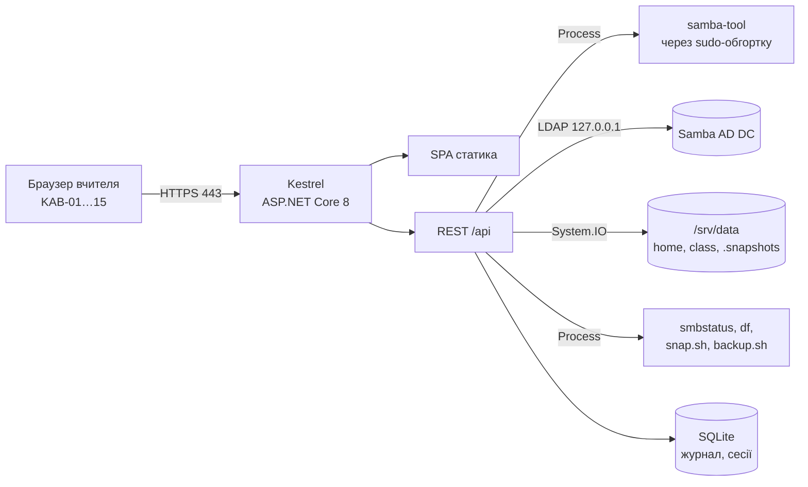

# School Class Manager — план розробки

2026-09-24 · Viktor

## Рішення й скоуп

Веб-застосунок, що працює на тому самому Raspberry Pi, де стоїть Samba AD: вчитель відкриває `https://dc1.ad.school.lan` з будь-якого ПК класу, входить своїм доменним логіном і керує учнями та файлами. Бекенд виконує `samba-tool`, читає `/srv/data` і `smbstatus` локально — жодних SSH-ключів чи SMB-монтувань на клієнті.

Мокап екранів (чинний для веб-версії): [School Class Manager — мокап](https://claude.ai/artifact/Mir1TQ4aNCZreU333AeEvX).

| У скоупі v1 | Поза скоупом v1 |
| --- | --- |
| Учні: список, створення, CSV-імпорт, скидання пароля, розблокування, вимкнення, зарахування класу на новий навчальний рік, картки логінів PDF | Join ПК у домен, GPO, sysprep, Clonezilla — залишаються в інструкції |
| Файли: роздатки (upload у `handouts`), здані роботи (`submit`, «хто не здав», ZIP), перегляд і завантаження з папок учнів, відновлення зі знімка кнопкою | Редагування файлів у браузері, редагування ACL |
| Огляд: стан Pi, диск, бекап, знімки, активні сесії, журнал подій | Моніторинг ПК класу, керування ПК |
| Сервер: знімок/бекап зараз, знімки, логи, стан оновлень | Майстер первинного налаштування Pi (він не може працювати на сервері, якого ще нема — залишаються ручні Етапи 1–4 інструкції і `pi/install.sh`) |
| Налаштування: домен, шляхи, ролі, генератор паролів | Кілька серверів, доступ з-поза мережі школи, мобільний застосунок |

**Користувачі.** Admin (ви: усе) і Teacher (учні, файли, огляд). Роль — з членства в групах AD, не з конфігу. Учні застосунок не бачать: сервіс доступний лише з підмережі класу, а вхід вимагає членства в `vchyteli` або `Domain Admins`.

**Обмеження.** Один Pi, один домен, до \~500 облікових записів (типово \~400 учнів у 15–20 класах на 10–15 ПК), 2–3 одночасні користувачі застосунку. Pi 4 з 4 GB: Samba + бекенд ≈ 400 MB RAM, запас є.

**Що дав перехід на веб.** Мінус SSH-ключ на клієнті, мінус LDAP-клієнт, мінус SMB-монтування, мінус пакування exe, мінус Mac/Windows-різниця у файлових операціях. Плюс: сертифікат HTTPS для домену, systemd-сервіс на Pi, in-app файловий перегляд замість Провідника. Сумарно менше коду і менше рухомих частин.

**Чесна оцінка.** 6–8 тижнів вечорами. Точка «досить» — кінець M1 (учні + паролі): вчитель уже не потребує вас для 80 % операцій.

## Архітектура

Один процес на Pi — ASP.NET Core (Kestrel), який віддає SPA як статику і REST API під `/api`. Усе, що раніше йшло трьома каналами з клієнта, тепер — локальні виклики всередині бекенду.



| Взаємодія | Механізм | Примітка |
| --- | --- | --- |
| Читання каталогу | LDAP через `ldap://127.0.0.1` під сервісним обліковим записом `svc-scm` (`ldapi:///` у Samba привілейований — лише root) | Локально; `System.DirectoryServices.Protocols` на Linux працює. Чи Samba прийме simple bind без TLS — ризик, перевірити на M0 |
| Зміни в AD | `sudo /usr/local/sbin/scm-user <op> <args>` — shell-обгортка над `samba-tool` з білим списком операцій | Сервіс не root; обгортка відхиляє логіни з `Domain Admins` і операції поза списком |
| Файли | `System.IO` по `/srv/data/...` | Сервіс отримує доступ через `AmbientCapabilities=CAP_DAC_OVERRIDE CAP_CHOWN CAP_FOWNER` у systemd, не через root і не через зміну ACL Samba |
| Стан сервера | `Process` → `smbstatus -b`, `df`, `smartctl -H`, `vcgencmd`, `free`, `uptime` | Через ту саму sudo-обгортку `scm-status` (JSON) |
| Знімки/бекап | `sudo snap.sh`, `sudo backup.sh` з інструкції; результат — хвіст логу через SSE | Ті самі скрипти, що вже стоять |
| Автентифікація | LDAP simple bind до Samba під логіном/паролем вчителя → cookie-сесія | Роль з `memberOf` при вході; v2 — Kerberos Negotiate (SSO) |
| Live-дані | Server-Sent Events `/api/events` для сесій, прогресу імпорту, логів | Простіше за SignalR, вистачає для 3 клієнтів |

**Чому не Blazor Server.** Один стек — спокуслива перевага, але SignalR-circuit втрачає стан при кожному обриві Wi-Fi/сплячому ноутбуку, а UI мокапу вже HTML/CSS і переноситься в React напряму. Blazor WASM — 10+ MB на перший вхід з Pi по гігабіту прийнятно, але дебажити гірше. React + REST — те, що ви й Claude Code пишете швидше за все.

**Чому не окремий агент + reverse proxy (nginx).** Kestrel сам тримає HTTPS і статику; nginx додає компонент без виграшу для 3 користувачів. Якщо колись знадобиться — стає перед Kestrel без змін у коді.

**Шари бекенду.**

| Шар | Відповідальність |
| --- | --- |
| `Scm.Core` | Моделі, інтерфейси (`IDirectory`, `IAccountCommands`, `IFileStore`, `IServerOps`, `IJournal`, `ICardPrinter`, `IPasswordGenerator`), use-case-и; без ASP.NET і без Process |
| `Scm.Infrastructure` | `LdapDirectory`, `SudoRunner` + `SudoAccountCommands`, `LocalFileStore`, `SudoServerOps` (+ парсери), `SqliteJournal`, `QuestPdfCardPrinter` |
| `Scm.Api` | Minimal API, auth, SSE, статика SPA, health, OpenAPI |
| `web/` | React + TypeScript SPA за мокапом |

## Технологічний стек

.NET 8 на arm64 у Raspberry Pi OS — офіційно підтримувана платформа; Kestrel на Pi 4 тримає сотні запитів/с, нам потрібно одиниці.

| Область | Вибір | Відхилено | Причина |
| --- | --- | --- | --- |
| Runtime | .NET 8 LTS, `linux-arm64`, self-contained publish | .NET 9; Node/Go бекенд | LTS; ваш основний стек; один бінарник без залежностей на Pi |
| Web | ASP.NET Core Minimal API + `Microsoft.AspNetCore.Authentication.Cookies` | MVC controllers; Blazor | Мало ендпоінтів, cookie-сесія достатня |
| API-контракт | OpenAPI (Swashbuckle) → генерація TS-клієнта (`openapi-typescript`) | ручні типи | Один source of truth для фронту |
| Фронтенд | React 18 + TypeScript + Vite; TanStack Query; TanStack Table; react-router | Vue, Svelte, Angular | Найкраща підтримка в Claude Code; DataGrid на 500 рядків без плагінів |
| UI-кит | Ant Design 5 (`antd`) + `@ant-design/icons`; тема через `ConfigProvider` tokens; локаль `uk_UA` | Mantine, MUI, shadcn/ui | Table з сортуванням/фільтрами, Upload.Dragger, Form, Modal, Statistic, Tabs — усі елементи мокапу з коробки; найкраще покриття в Claude Code; \~250 KB gzip після tree-shaking прийнятно для LAN |
| Live | Server-Sent Events | SignalR, WebSocket | Односпрямовано, нативно в браузері, працює через будь-який проксі |
| LDAP | `System.DirectoryServices.Protocols` | Novell.Directory.Ldap | Стандартна бібліотека, на Linux працює |
| Процеси | `System.Diagnostics.Process` з `ArgumentList` (власний `ProcessRunner`: таймаут, cancel, паралельне читання stdout/stderr) | CliWrap | CliWrap склеює аргументи в один рядок `Arguments`, а правило — кожен аргумент окремо в `ArgumentList` |
| БД | SQLite (`Microsoft.Data.Sqlite` + Dapper), файл у `/var/lib/scm/scm.db` | Postgres, EF Core | Журнал + кеш; жодних join-ів |
| PDF | QuestPDF (Community) з вбудованим шрифтом IBM Plex Sans (кирилиця) | wkhtmltopdf, Puppeteer | Без Chromium на Pi |
| CSV | CsvHelper | ручний парсинг | BOM, лапки, `;` замість `,` з українського Excel |
| Логи | Serilog → `journald` + SQLite-sink для журналу подій | файл | `journalctl -u scm` — там, де адмін і так дивиться |
| Тести | xUnit, FluentAssertions, NSubstitute; `WebApplicationFactory` для API; Vitest + Testing Library для SPA |  |  |
| Збірка | GitHub Actions: `dotnet test` + `vite build` + `dotnet publish -r linux-arm64` → tar.gz як release-артефакт |  | Pi завантажує реліз скриптом `scm-update` |
| HTTPS | Сертифікат від власного міні-CA (`step-cli` або `openssl`), корінь у GPO Trusted Root | Let's Encrypt | Домен `.lan` не валідується ззовні; GPO роздає корінь усім ПК за 5 хв |

Вимоги для розробки: .NET 8 SDK і Node 20 на Mac; для інтеграційних тестів — Pi по SSH або Docker-контейнер з Samba AD (`instantlinux/samba-dc` або власний) на x64 — бекенд не залежить від arm64, лише publish.

Не брати: Identity/EF-based auth (у нас AD), MediatR, AutoMapper, Redux (TanStack Query покриває стан сервера, локального стану — на два `useState`).

## Доменна модель і REST API

Джерело істини — AD і файлова система на Pi; SQLite зберігає лише журнал і кеш. API — ресурсний, з OpenAPI-схемою, з якої генерується TS-клієнт.

### Сутності

| Сутність | Поля | Джерело |
| --- | --- | --- |
| `Student` | `login` (`ivanenko.petro.2011` — один на все навчання), `surname`, `givenName`, `classCode` (поточний = група з найновішим роком), `classHistory[]`, `status` (Active / Locked / Disabled / NeverLoggedIn), `lastLogon`, `lastLogonPc`, `homeSizeBytes`, `passwordChangedAt` | LDAP: `sAMAccountName`, `sn`, `givenName`, `memberOf`, `userAccountControl`, `lockoutTime`, `lastLogonTimestamp`, `pwdLastSet`; ПК — з `smbstatus`/журналу; розмір — фоновий підрахунок `du` по `/srv/data/home/<login>` раз на 15 хв, кеш у SQLite (не під час запиту: 400 папок на HDD — це секунди–хвилини) |
| `SchoolClass` | `code` (`2025-4a`), `schoolYear` (2025 = 2025/26), `displayName` (`4-А`), `studentCount` | Група `uchni-<код>`; клас — лише група, історія класів учня = його членство в групах минулих років |
| `Session` | `pc`, `login`, `since`, `ip` | `smbstatus -b` |
| `Snapshot` | `takenAt`, `path` | `/srv/data/home/.snapshots/@GMT-*` |
| `FileEntry` | `name`, `sizeBytes`, `modifiedAt`, `owner` | `System.IO` + власник через `stat` uid → `getent passwd` |
| `ServerStatus` | `online`, `uptimeSec`, `load1`, `ramUsedMb`, `ramTotalMb`, `tempC`, `dataDisk{used,total,smartOk}`, `backupDisk{…}`, `lastBackup{at,ok,durationSec}`, `lastSnapshot{at,ok}`, `sambaVersion` | `scm-status` JSON (`pi/sbin/scm-status`); зараз він віддає `lastSnapshot.name` замість `at`, без `durationSec`, і додатково `sessions` — узгодити в M4 разом із фікстурою |
| `JournalEntry` | `at`, `actor`, `action`, `target`, `result`, `details` | SQLite |

### Ендпоінти

| Метод і шлях | Дія | Роль |
| --- | --- | --- |
| `POST /api/auth/login` | LDAP bind, встановити cookie; повертає `{login, name, role}` | — |
| `POST /api/auth/logout` |  | Teacher |
| `GET /api/me` |  | Teacher |
| `GET /api/classes?year=` | за замовчуванням — поточний навчальний рік | Teacher |
| `GET /api/students?class=2025-4a&q=` | список з кешем 30 с | Teacher |
| `GET /api/students/{login}` | картка + знімки папки | Teacher |
| `POST /api/students` | `{surname, givenName, birthYear, classCode}` → `{login, password}`; збіг логіна або > 20 символів навіть з ініціалом → 409 з пропозицією ввести логін вручну (`login` у тілі) | Teacher |
| `POST /api/students/import` | multipart CSV, `?dryRun=true` → превʼю з помилками; без dryRun — створення; SSE-прогрес через `/api/events` | Teacher |
| `POST /api/students/{login}/reset-password` | → `{password}`; пароль генерується на сервері | Teacher |
| `POST /api/students/{login}/unlock` |  | Teacher |
| `POST /api/students/{login}/disable`, `/enable` |  | Teacher |
| `POST /api/classes/{code}/promote` | `{toCode}` — зарахувати всіх учнів класу в клас нового навчального року (`2025-4a` → `2026-5a`); зі старої групи не виключає; прогрес через SSE | Admin |
| `POST /api/students/cards` | `{logins[]}` → PDF; тільки логіни з паролем у поточній сесії, інакше 409 зі списком | Teacher |
| `GET /api/classes/{code}/handouts` |  | Teacher |
| `POST /api/classes/{code}/handouts` | multipart, до 200 MB, стрімінг на диск | Teacher |
| `DELETE /api/classes/{code}/handouts/{name}` |  | Teacher |
| `GET /api/classes/{code}/submissions` | + `missing[]` = учні класу без файлів | Teacher |
| `GET /api/classes/{code}/submissions.zip` |  | Teacher |
| `POST /api/classes/{code}/submissions/archive` | перемістити в `_archive/<дата>` | Teacher |
| `GET /api/students/{login}/files?path=` | перегляд папки учня (тільки читання) | Teacher |
| `GET /api/students/{login}/files/download?path=` |  | Teacher |
| `GET /api/students/{login}/snapshots` |  | Teacher |
| `POST /api/students/{login}/restore` | `{snapshot, path}` → копія в `Documents/Відновлено <дата>/` | Teacher |
| `GET /api/server/status` |  | Teacher |
| `GET /api/server/sessions` |  | Teacher |
| `POST /api/server/snapshot`, `/backup` | запуск; прогрес через SSE | Admin |
| `GET /api/server/snapshots`, `DELETE …/{ts}` |  | Admin |
| `GET /api/server/logs?unit=samba-ad-dc&lines=200` |  | Admin |
| `GET /api/journal?from=&to=&actor=` |  | Teacher (свої) / Admin (усі) |
| `GET /api/events` | SSE: `session`, `job-progress`, `job-done`, `alert` | Teacher |
| `GET /healthz` | Samba працює, LDAP відповідає, диск змонтований | — |
| `POST /api/teachers/{login}/reset-password` | те саме для вчителя; бекенд додає `--teacher` до `scm-user` | Admin |

### Операції → що виконує бекенд

| Операція | Виконання на Pi |
| --- | --- |
| Створити учня | `sudo scm-user create <login> --given-name --surname --class 2025-4a` (пароль — stdin) → обгортка викликає `samba-tool user create … --userou=OU=Uchni` і `group addmembers uchni-2025-4a`. У M2 обгортка має додавати `--profile-path=\\dc1\netlogon\profiles\uchni`, якщо обов'язковий профіль уже існує — як `add-uchni.sh` (`docs/deployment.md`, Етапи 6 і 9) |
| Скинути пароль | `sudo scm-user setpassword <login>` (пароль — stdin) |
| Розблокувати / вимкнути / увімкнути | `sudo scm-user unlock <login>` / `disable` / `enable`; для вчителя — з `--teacher` |
| Зарахувати на новий рік | `sudo scm-user enroll <login> 2026-5a` для кожного учня класу — лише `group addmembers`; зі старих груп не виключає. Групу й папки нового класу створює адмін заздалегідь (інструкція, «Експлуатація»). Переведення учня між класами немає |
| Імпорт | той самий `create` у циклі, послідовно, з таймаутом 10 с на рядок; звіт по кожному |
| Роздатки | запис у `/srv/data/class/2025-4a/handouts/`, `chown` на uid вчителя-власника, права 644 |
| Здані роботи | список `/srv/data/class/2025-4a/submit/<login>/`; власник = назва підпапки; «не здав» = учні групи класу з порожньою або відсутньою підпапкою |
| Відновлення | копія з `.snapshots/@GMT-…/<login>/<path>` у `home/<login>/Documents/Відновлено <дата>/`, власник — учень |
| Стан | `sudo scm-status` (JSON, кеш 10 с на бекенді) |
| Знімок/бекап | `sudo snap.sh` / `sudo backup.sh`; stdout → SSE |

Правило: кожна мутація пише в журнал `Started` / `Succeeded` / `Failed` з `actor` із cookie, а не з тіла запиту. Пароль ніколи не потрапляє в журнал і логи.

## Модулі та екрани

Макет — Ant Design `Layout` із темним `Sider` і білим `Header` (breadcrumb + користувач), п'ять маршрутів `react-router`. Кожен екран — одна сторінка з `TanStack Query`-хуками до API; діалоги — `Modal`/`Drawer` з `Form`.

| Екран | Компоненти antd | Дані |
| --- | --- | --- |
| Огляд `/` | `Alert` (попередження), `Card`+`Statistic` ×4, `Progress` для диска, `Table` сесій, `Timeline` подій | `/server/status` (poll 30 с), `/server/sessions` (SSE), `/journal` |
| Учні `/students` | `Select` класу з пошуком + «Вчителі» (15–20 класів не влазять у `Radio.Group`), `Input.Search`, `Table` з `rowSelection`, сортуванням і фільтром статусу, `Tag`, `Pagination`; права `Card` з `Descriptions` + кнопки + список знімків | `/students`, `/students/{login}` |
| Файли `/files` | `Select` класу, `Tabs` з `Badge`, `Upload.Dragger`, `Table` ×2, `Progress`, `Tag` для «не здали» | `/classes/{code}/handouts`, `/submissions` |
| Сервер `/server` | `Descriptions`, `Table` знімків, `Button` з `Popconfirm`, `<pre>` з логом через SSE | `/server/*` |
| Налаштування `/settings` | `Form` з `Input`, `Select`, `Switch`; `Descriptions` для доменних параметрів (read-only) | `/settings` |

### Огляд

- Картки: сервер (онлайн, load, RAM, температура), диск даних, останній бекап, останній знімок. Підсвітка `warning`/`error`: бекап > 36 год, знімок > 3 год у робочий час, диск > 85 %, SMART не OK, температура > 70 °C.
- `Alert` угорі — активні проблеми з посиланням на лог; зникає, коли проблема зникла.
- «Зараз у класі» — оновлення через SSE `session`; клік на учня → його картка.
- Події — останні 6 із журналу; «Журнал» веде на повну таблицю з фільтрами.
- Кнопки «Знімок зараз», «Бекап зараз» → `Modal` з живим логом і статусом; тільки Admin.
- Pi недоступний = недоступний і застосунок; це нормально: SPA показує сторінку «Сервер недоступний» з часом останнього відгуку (кешовано в `localStorage`).

### Учні

- Таблиця з колонками з мокапу; статус — `Tag` (`success`/`warning`/`default`/`error`); клік на прізвище — картка праворуч; `rowSelection` вмикає панель масових дій (скинути паролі, картки, вимкнути).
- Картка: `Descriptions` (логін, поточний клас і попередні, останній вхід і ПК, папка, пароль змінено), дії, знімки папки за 30 днів із «Відновити…» → `Modal` з деревом файлів знімка.
- «+ Учень» — `Modal` з `Form`: клас, прізвище, ім'я, рік народження; логін (`прізвище.ім'я.рік`, > 20 символів — ім'я до ініціала) і пароль генеруються на сервері й показуються в результаті з кнопкою «Картка PDF». Якщо такий логін уже є — форма просить вчителя ввести логін вручну.
- «Імпорт CSV» — `Steps`: файл (прізвище, ім'я, рік народження, клас) → превʼю (`Table` з підсвіткою помилок: збіг логіна — вчитель вписує логін у рядку, невідомий клас, порожнє прізвище, неправдоподібний рік) → створення з `Progress` через SSE → звіт → «Картки для створених».
- «Картки логінів» — для вибраних/класу; учні без відомого пароля показуються в `Alert` з пропозицією масового скидання.
- Скидання пароля показує новий пароль у `Modal` з кнопкою копіювання й «Друк картки» — один раз; після закриття пароль лишається тільки в сесії для PDF.

### Файли

- Вкладка «Роздатки»: `Upload.Dragger` (multiple, до 200 MB, `beforeUpload` перевіряє розширення), таблиця з видаленням через `Popconfirm`.
- Вкладка «Здані роботи»: прогрес «N з M», таблиця з власником, `Badge` з кількістю тих, хто не здав; «Хто не здав» — `Modal` зі списком; «ZIP» — завантаження; «Очистити після уроку» — `Popconfirm` → архів.
- Вкладка «Папки учнів»: таблиця учень → файлів/розмір/остання зміна; клік → `Drawer` з деревом папки (`Tree`) тільки на читання і завантаженням файлу.
- Ярлик «Роздатки» на Робочому столі учня створює GPO logon-скрипт `pi/gpo/submit-logon.ps1` (інструкція, Етап 8.1); застосунок цим не керує.

### Сервер (Admin)

- `Descriptions`: версії Samba/ОС/ядра/застосунку, uptime, диски з SMART.
- Знімки: таблиця з розміром і «Видалити старіші за…».
- Бекап: останні 10 запусків з журналу, «Запустити».
- Логи: `Select` юніта (`samba-ad-dc`, `scm`, `snap`, `backup`) + 200 останніх рядків + «Оновити».
- Оновлення: показує доступну версію застосунку з GitHub Releases, кнопка «Оновити» → `scm-update` (окремий systemd-юніт, бо сервіс не може перезапустити сам себе всередині запиту).

### Налаштування

- Домен: realm, base DN, OU учнів, групи (read-only, з `appsettings`).
- Шляхи: `home`, `class`, `.snapshots` (read-only).
- Генератор паролів: словник складів, довжина, чи додавати цифру — редагується.
- Ролі: які групи AD дають Admin/Teacher — редагується Admin-ом.
- «Про застосунок»: версія, посилання на журнал, на інструкцію впровадження.

### Наскрізне

- Підтвердження незворотних дій через `Popconfirm`/`Modal.confirm` із текстом, що саме виконається.
- Помилки API → `notification.error` з людським текстом і кнопкою «Деталі» (stderr обгортки).
- Усі рядки — `i18n` (react-i18next), `uk` за замовчуванням; `antd` `ConfigProvider locale={uk_UA}`.
- Клавіатура: `/` — фокус у пошук, `F5` — оновити, `Esc` — закрити діалог.
- Адаптивність — від 1024 px; на планшеті `Sider` згортається.

## Безпека

Застосунок стоїть на контролері домену і може змінювати паролі — тому три межі: мережева (тільки клас), автентифікація (тільки вчителі, через AD), привілеї (сервіс не root, `samba-tool` лише через обгортку з білим списком).

### Автентифікація й авторизація

- Вхід: логін + пароль домену → LDAP simple bind до `ldap://127.0.0.1` (без TLS, бо не виходить за межі Pi; чи Samba це дозволить — перевірити на M0, див. «Ризики»). Невдалий bind = 401; 5 невдач за 10 хв з однієї IP = 429 на 10 хв (в AD теж спрацює lockout — не плутати з блокуванням учня).
- Після bind — пошук `memberOf`: `Domain Admins` → Admin, `vchyteli` → Teacher, інакше 403 «доступ лише для вчителів». Учнівські облікові записи ніколи не проходять. Bind під вчителем лише перевіряє пароль; пароль вчителя після входу ніде не зберігається.
- Читання каталогу (списки учнів, класи, фонові задачі) — під `svc-scm`: звичайний доменний користувач без груп і прав на запис; читання атрибутів користувачів AD дає будь-якому автентифікованому. Пароль — випадковий, 32+ символи, без строку дії, у `/etc/scm/ldap.secret` (600, `scm`); вхід на ПК класу заборонено GPO (`Deny log on locally`). Відхилено bind під вчителем для читання: довелося б тримати його пароль у пам'яті сесії, а фонові задачі (розміри папок, сесії) працюють без вчителя.
- Сесія — cookie `HttpOnly; Secure; SameSite=Strict`, 8 годин, ключі Data Protection у `/var/lib/scm/keys`.
- Кожен ендпоінт має явну політику `RequireRole("Teacher")` / `"Admin"`; без атрибута — 403 за замовчуванням (`FallbackPolicy`).
- v2: Kerberos Negotiate через keytab (`Microsoft.AspNetCore.Authentication.Negotiate` на Linux) → SSO з доменного ПК без форми входу. Не в v1: keytab, SPN `HTTP/dc1.ad.school.lan` і налагодження браузерів — окремий тиждень.

### HTTPS у домені

1. Один раз: `openssl` (або `step-cli`) створює кореневий CA «SCHOOL Class CA» і сертифікат для `dc1.ad.school.lan` + `dc1` + IP на 5 років. Приватний ключ CA — офлайн, у конверті.
2. Корінь роздається всім ПК через GPO: Computer Configuration → Policies → Windows Settings → Security Settings → Public Key Policies → Trusted Root Certification Authorities (інструкція, Етап 8.3).
3. Kestrel читає PFX з `/etc/scm/tls.pfx` (права 600, власник `scm`); HTTP 80 лише редіректить на 443.
4. Chrome/Edge на доменних ПК довіряють через системне сховище; Firefox — увімкнути `security.enterprise_roots.enabled` тією ж GPO (ADMX Firefox) або не використовувати Firefox.

### Привілеї сервісу на Pi

- systemd-юніт `scm.service`: `User=scm`, `Group=scm`, `AmbientCapabilities=CAP_DAC_OVERRIDE CAP_CHOWN CAP_FOWNER` (доступ до файлів учнів без root) + `CAP_NET_BIND_SERVICE` (порти 80/443), `NoNewPrivileges` не вмикати (потрібен sudo), `ProtectSystem=strict`, `ProtectHome=yes`, `ReadWritePaths=/srv/data /var/lib/scm`, `PrivateTmp=yes`.
- `/etc/sudoers.d/scm` — лише обгортки, без wildcard-ів:

  ```
  Defaults:scm !requiretty
  scm ALL=(root) NOPASSWD: /usr/local/sbin/scm-user, /usr/local/sbin/scm-status, /usr/local/sbin/scm-logs, /usr/local/sbin/snap.sh, /usr/local/sbin/backup.sh, /usr/bin/systemctl start scm-update.service
  ```
- `scm-user` (bash, \~60 рядків): приймає лише `create|setpassword|unlock|enable|disable|enroll`; валідує логін учня regex-ом `^[a-z]+(-[a-z]+)?\.[a-z]+(-[a-z]+)?(\.[a-z])?\.(19|20)[0-9]{2}$` (необов'язкова літера перед роком — ручний вибір при збігу, напр. ініціал по батькові) і довжину ≤ 20, клас — `^20[0-9]{2}-[0-9]{1,2}[a-z]$`; відмовляє, якщо ціль у `Domain Admins`; ціль у `vchyteli` — лише з прапорцем `--teacher`, який бекенд передає тільки для ролі Admin; інакше ціль має бути в `OU=Uchni`; пароль читає зі stdin, не з аргументів (щоб не світився в `ps`); пише в `journald`.
- `scm-logs <юніт> [рядків]`: `journalctl -u` для `samba-ad-dc`, `scm`, `scm-update`; хвіст `/var/log/snap.log` і `/var/log/backup.log` для `snap`, `backup`; інше — відмова.
- Бекенд ніколи не збирає команду конкатенацією рядків: `ProcessStartInfo.ArgumentList`, кожен аргумент окремо.

### Мережа

- Kestrel слухає на IP Pi; `nftables`: 443 і 80 лише з `192.168.1.0/24`. Ззовні школи застосунку не існує.
- Rate limit на `/api/auth/login`; на решту — 100 запитів/хв на сесію (`Microsoft.AspNetCore.RateLimiting`).
- Заголовки: HSTS, `X-Content-Type-Options`, `Content-Security-Policy: default-src 'self'`.

### Дані

- Паролі учнів: генеруються на сервері, віддаються у відповіді один раз, тримаються в пам'яті сесії (`IMemoryCache` з TTL 8 год) лише для PDF-карток; у журнал — ніколи.
- Файли учнів віддаються стрімом з перевіркою, що шлях не виходить за `home/<login>` (`Path.GetFullPath` + `StartsWith`).
- Завантаження: ліміт 200 MB, розширення з білого списку, ім'я файлу санітизується, `chown` на учительський uid.
- Журнал: append-only з UI; експорт CSV для директора; ротація — старше 2 років видаляється.

### Що лишається ризиком

- Фізичний доступ до незаблокованого вчительського ПК під відкритою сесією — блокування екрана 5 хв у GPO.
- Уразливість у Kestrel/antd — оновлення застосунку раз на семестр, `dotnet list package --vulnerable` у CI.
- Компрометація сервісу `scm` = змога міняти паролі учнів, але не адмінів і не вчителів (обгортка), і не читати базу AD (немає прав на `/var/lib/samba/private`); пароль `svc-scm` дає лише те читання каталогу, яке й так має будь-який доменний користувач.
- `scm-user` отримує пароль через stdin, але передає його в `samba-tool` аргументом (`--newpassword=…`, позиційний у `create`) — поки `samba-tool` працює (частки секунди), пароль видно в `ps` локальним користувачам Pi. На Pi входять лише адміни; прибрати, якщо `samba-tool` навчиться читати пароль зі stdin.

## Структура репозиторію

Монорепо: .NET-бекенд у `src/`, SPA у `web/`, скрипти для Pi у `pi/`. `Scm.Api` при `publish` вбудовує `web/dist` як статику — на Pi їде один tar.gz.

```
school-class-manager/
├─ CLAUDE.md                        # контекст для Claude Code: стек, команди, правила, посилання
├─ SchoolClassManager.sln
├─ Directory.Build.props             # net8.0, Nullable, ImplicitUsings, TreatWarningsAsErrors
├─ src/
│  ├─ Scm.Core/
│  │  ├─ Model/                      # Student, SchoolClass, Session, Snapshot, FileEntry, ServerStatus, JournalEntry
│  │  ├─ Ports/                      # IDirectory, IAccountCommands, IFileStore, IServerOps, IJournal, ICardPrinter, IPasswordGenerator
│  │  ├─ UseCases/                   # CreateStudent, ImportStudents, ResetPassword, CollectSubmissions, RestoreFromSnapshot, GetDashboard…
│  │  ├─ Services/                   # LoginGenerator (КМУ №55), PasswordGenerator, CsvStudentParser
│  │  └─ Results/                    # Result<T>, DomainError
│  ├─ Scm.Infrastructure/
│  │  ├─ Ldap/                       # LdapDirectory, LdapAuthenticator
│  │  ├─ Process/                    # ProcessRunner, SudoRunner (ArgumentList), SudoAccountCommands, парсери smbstatus/scm-status/df
│  │  ├─ Files/                      # LocalFileStore (/srv/data), PathGuard, OwnerResolver (uid → login)
│  │  ├─ Sqlite/                     # SqliteJournal, migrations/*.sql, PasswordSessionCache
│  │  └─ Pdf/                        # QuestPdfCardPrinter + Fonts/IBMPlexSans-*.ttf
│  └─ Scm.Api/
│     ├─ Program.cs                  # Kestrel, auth, rate limit, static files, OpenAPI
│     ├─ Endpoints/                  # Auth, Students, Classes, Files, Server, Journal, Events (SSE)
│     ├─ Auth/                       # LdapCookieAuth, RolePolicies
│     ├─ Sse/                        # EventBus → text/event-stream
│     ├─ Jobs/                       # JobRunner для snapshot/backup/import з прогресом
│     └─ appsettings.json            # Domain, Paths, Roles, PasswordPolicy
├─ web/
│  ├─ package.json, vite.config.ts, tsconfig.json
│  └─ src/
│     ├─ api/                        # client.ts (згенеровано з OpenAPI), hooks/ (TanStack Query)
│     ├─ app/                        # App.tsx, router.tsx, AppLayout.tsx (Sider+Header), theme.ts (ConfigProvider tokens)
│     ├─ pages/                      # Dashboard, Students, Files, Server, Settings, Login
│     ├─ components/                 # StudentCard, StudentTable, ImportWizard, CardsPdfButton, JobLogModal…
│     ├─ i18n/uk.json, en.json
│     └─ lib/                        # sse.ts, format.ts (розміри, дати)
├─ pi/
│  ├─ scm.service                    # systemd-юніт
│  ├─ scm-update.service             # oneshot для sbin/scm-update
│  ├─ sudoers.d/scm
│  ├─ sbin/                          # scm-user, scm-status, scm-logs, scm-update, snap.sh, backup.sh, add-uchni.sh
│  ├─ gpo/submit-logon.ps1           # logon-скрипт: підпапка submit + ярлик «Роздатки»
│  ├─ nftables/scm.nft
│  ├─ tls/make-ca.sh, issue-cert.sh
│  └─ install.sh                     # idempotent: користувач, каталоги, юніти, sudoers, nftables
├─ tests/
│  ├─ Scm.Core.Tests/                # генератори, парсер CSV, use-case-и з фейками
│  ├─ Scm.Infrastructure.Tests/      # парсери на фікстурах, PathGuard, SudoRunner (аргументи)
│  ├─ Scm.Api.Tests/                 # WebApplicationFactory: auth, політики, контракти ендпоінтів
│  └─ Scm.Integration.Tests/         # проти Pi або Docker Samba AD; [Trait("Integration")]
├─ tools/pi-fixtures/                # реальні виводи команд з Pi, з версією Samba в імені
├─ docs/                             # plan.md, deployment.md, mockups.md; teacher-guide.md — M5
└─ .github/workflows/ci.yml          # dotnet test + vitest + vite build + publish linux-arm64 (артефакт); release tar.gz — M6
```

### Ключові контракти (`Scm.Core/Ports`)

```csharp
public interface IAccountCommands
{
    Task<Result> CreateAsync(NewStudent s, string password, CancellationToken ct);
    Task<Result> SetPasswordAsync(Login login, string password, CancellationToken ct);
    Task<Result> UnlockAsync(Login login, CancellationToken ct);
    Task<Result> SetEnabledAsync(Login login, bool enabled, CancellationToken ct);
    Task<Result> EnrollAsync(Login login, ClassCode cls, CancellationToken ct);   // додати в групу класу; переведення немає
}

public interface IDirectory
{
    Task<AuthResult> AuthenticateAsync(string login, string password, CancellationToken ct);
    Task<IReadOnlyList<Student>> GetStudentsAsync(ClassCode? cls, CancellationToken ct);
    Task<Student?> GetStudentAsync(Login login, CancellationToken ct);
    Task<IReadOnlyList<SchoolClass>> GetClassesAsync(CancellationToken ct);
}

public interface IFileStore
{
    Task<IReadOnlyList<FileEntry>> ListAsync(StorePath path, CancellationToken ct);
    Task SaveAsync(StorePath dir, string fileName, Stream content, Owner owner, CancellationToken ct);
    Task<Stream> OpenReadAsync(StorePath file, CancellationToken ct);
    Task<IReadOnlyList<Snapshot>> GetSnapshotsAsync(Share share, CancellationToken ct);
    Task RestoreAsync(Login login, Snapshot snap, string relPath, CancellationToken ct);
}

public sealed record Login(string Value);          // учень: "ivanenko.petro.2011" (≤ 20), вчитель: "viktor.admin"
public sealed record ClassCode(string Value);      // "2025-4a": рік початку навчального року + клас
public sealed record StorePath(Share Share, string Relative); // без "..", завжди під коренем шари
```

`Login`, `ClassCode`, `StorePath` — value-об'єкти, що валідуються при створенні: невалідне значення не доходить ні до обгортки, ні до файлової системи.

### `CLAUDE.md` (зміст)

- Команди: `dotnet build`, `dotnet test`, `cd web && npm run dev` (проксі `/api` і `/healthz` на локальний бекенд `http://localhost:5000`), `npm run gen:api` (OpenAPI → TS).
- Правила: use-case-и в Core; Process/LDAP/IO лише в Infrastructure; команди на Pi — тільки через `SudoRunner` з `ArgumentList`; кожна мутація → `IJournal`; всі рядки UI — через i18n; компоненти — тільки з antd, без власних кнопок/таблиць.
- Посилання: `docs/plan.md`, `docs/deployment.md`, мокап.
- Як додати фікстуру: команда на Pi → `tools/pi-fixtures/<команда>.<samba-версія>.<txt|json|ldif>` (без версії — для команд, що не залежать від Samba) → тест парсера.

## Розгортання на Pi

Один tar.gz з GitHub Releases → `/opt/scm/<версія>/` → символьне посилання `/opt/scm/current` → `systemctl restart scm`. Відкат — переставити посилання. Робить це `pi/install.sh` уперше і `scm-update` далі.

### Перше встановлення (після Етапу 4 інструкції, \~30 хв)

1. `sudo useradd -r -s /usr/sbin/nologin -d /var/lib/scm scm`; каталоги `/opt/scm`, `/var/lib/scm`, `/etc/scm` з правами `scm`.
2. Скопіювати `pi/sbin/*` у `/usr/local/sbin/` (root, 755), `pi/sudoers.d/scm` у `/etc/sudoers.d/` (440), перевірити `visudo -c`.
3. TLS: `pi/tls/make-ca.sh` (один раз, ключ CA — у конверт), `issue-cert.sh dc1.ad.school.lan 192.168.1.2` → `/etc/scm/tls.pfx` (600, `scm`). Корінь CA → GPO (Етап 8).
4. `pi/nftables/scm.nft` → `/etc/nftables.d/`, `systemctl reload nftables`.
5. `appsettings.Production.json` у `/etc/scm/`: realm, base DN, OU, групи, шляхи, PFX, пароль PFX (або порожній); сервісний `svc-scm` і `/etc/scm/ldap.secret`.
6. `pi/scm.service` → `/etc/systemd/system/`, `systemctl enable --now scm`; перевірити `curl -k https://127.0.0.1/healthz` і `journalctl -u scm -n 50`.
7. Зайти з `KAB-01` під `viktor.admin`, пройти приймальний чекліст.

`install.sh` робить п. 1, 2, 4 і 6 idempotent-но, а також створює `svc-scm` з `/etc/scm/ldap.secret`, якщо їх немає; для п. 3 лише підказує запустити скрипти TLS, для п. 5 створює `appsettings.Production.json` зі значеннями за замовчуванням, які треба перевірити; реліз ставить `scm-update`.

### `scm.service`

```ini
[Unit]
Description=School Class Manager
After=network-online.target samba-ad-dc.service srv-data.mount
Wants=network-online.target
Requires=samba-ad-dc.service

[Service]
User=scm
Group=scm
WorkingDirectory=/opt/scm/current
ExecStart=/opt/scm/current/Scm.Api
Environment=ASPNETCORE_ENVIRONMENT=Production
Environment=DOTNET_gcServer=0
Environment=ASPNETCORE_URLS=https://0.0.0.0:443;http://0.0.0.0:80
AmbientCapabilities=CAP_DAC_OVERRIDE CAP_CHOWN CAP_FOWNER CAP_NET_BIND_SERVICE
ProtectSystem=strict
ProtectHome=yes
ReadWritePaths=/srv/data /var/lib/scm
PrivateTmp=yes
MemoryMax=768M
Restart=on-failure
RestartSec=5

[Install]
WantedBy=multi-user.target
```

Джерело істини — `pi/scm.service`; тут копія. `DOTNET_gcServer=0` — workstation GC, інакше .NET на 4 ядрах відкусить зайві 200 MB. `MemoryMax` — запобіжник, щоб Samba не постраждала.

### Оновлення

- `scm-update` (bash): бере останній реліз з GitHub API, перевіряє SHA256, розпаковує в `/opt/scm/<версія>`, переставляє `current`, `systemctl restart scm`, чекає `healthz`; при невдачі — повертає посилання і рестарт.
- Запускається з UI (кнопка «Оновити» → `systemctl start scm-update.service`, окремий юніт, бо сервіс не перезапускає сам себе) або вручну по SSH.
- Pi має доступ до `github.com` через роутер — це єдина зовнішня адреса, яка потрібна.

### Що змінюється в інструкції впровадження

| Етап | Зміна |
| --- | --- |
| 1 (Pi) | Додати `apt install nftables`; `dotnet` не потрібен — publish self-contained |
| 3 (шари) | Клас = `<рік>-<клас>` (`class\2025-4a`); `submit\<login>\` — підпапка на учня: ACL кореня `submit` — `vchyteli` повний, `uchni-<рік>-<клас>` перегляд списку + створення папок, `CREATOR OWNER` — зміна у підпапках; `hide unreadable` на `[class]`; підпапку створює GPO logon-скрипт; учень RW лише у своїй |
| 4 (бекапи) | `backup.sh` додатково копіює `/var/lib/scm/scm.db` і `/etc/scm/` |
| 6 (учні) | Логін `прізвище.ім'я.рік_народження` (≤ 20, інакше ім'я до ініціала), групи `uchni-<рік>-<клас>`; CSV `логін,пароль,2025-4a,Прізвище,Ім'я`; `add-uchni.sh` додає `--profile-path='\\dc1\netlogon\profiles\uchni'`, лише коли обов'язковий профіль уже існує; вчителям — ні |
| 7, 9 (еталон, тираж) | Профіль `kabadmin` = шаблон; `CopyProfile` у `unattend.xml`; після тиражу — обов'язковий профіль `\\dc1\netlogon\profiles\uchni.V6` (`NTUSER.MAN`), потім `profilePath` усім учням одним проходом `ldbmodify` |
| 8 (GPO) | + диск `H:` → `\\dc1\home\%LogonUser%` (Drive Maps); + `Klas-PC`: Delete cached copies of roaming profiles, Allow deployment operations in special profiles, Always wait for the network, Logon Script Delay 0; + Trusted Root: корінь «SCHOOL Class CA»; + logon-скрипт `pi/gpo/submit-logon.ps1` (поточний клас — за групою з найновішим роком; підпапка `submit` і ярлик «Роздатки» → `\\dc1\class\<рік>-<клас>\handouts`); + закладка `https://dc1.ad.school.lan` у Chrome для групи `vchyteli` |
| Експлуатація | Таблиця операцій: усе, крім оновлення ОС, тепер робиться з браузера; SSH — резерв. «Новий клас», «Новий навчальний рік» (зарахування цілим класом), «Учень прийшов посеред року» |
| Аварійні | «Застосунок не відкривається, Samba працює» → `journalctl -u scm`, `systemctl restart scm`; «після оновлення не піднявся» → `scm-update --rollback` |

## План розробки

Шість етапів; кожен закінчується деплоєм на Pi, який вчитель бачить у браузері. Оцінка — у вечірніх сесіях 2–3 год з Claude Code, «тиждень» = 5 сесій. M0 — обов'язковий: без живого Pi з Samba нема проти чого писати бекенд.

| Етап | Що здається | Ключові задачі | Оцінка |
| --- | --- | --- | --- |
| **M0 · Інфраструктура** | Pi з Samba AD, шари, знімки; ≥1 ПК у домені з GPO; 5 тестових учнів; `scm` + sudoers + обгортки; фікстури виводів | Етапи 1–8 інструкції; `pi/install.sh` частково; зняти виводи `samba-tool user show`, `ldbsearch` учнів і класів (LDIF), `smbstatus -b`, `scm-status`, `df`, `ls .snapshots` у `tools/pi-fixtures` (команди — у його README) | 3–4 дні (не вечори) |
| **M1 · Вхід + Учні + паролі** | `https://dc1…`: вхід доменним логіном, список учнів, картка, скидання пароля, розблокування, PDF-картка одного учня; деплой на Pi через `install.sh` | Рішення, `Directory.Build.props`, `CLAUDE.md`, CI; `SudoRunner` + `scm-user` + тести аргументів; `LdapDirectory` + `LdapAuthenticator` + cookie auth + політики; ендпоінти `auth`, `students`, `reset-password`, `unlock`; SQLite-журнал; SPA: `AppLayout`, `Login`, `Students` за мокапом; `QuestPdfCardPrinter`; TLS + GPO Trusted Root; systemd | 2,5 тижні |
| **M2 · Масові операції** | Створення учня, CSV-імпорт з превʼю і прогресом, картки класу, вимкнення/увімкнення, зарахування класу на новий рік, множинний вибір | `LoginGenerator` (`прізвище.ім'я.рік`, ≤ 20, перевірка збігу), `PasswordGenerator`, `CsvStudentParser` + валідація; `PromoteClass` як job з SSE; `scm-user create` задає `--profile-path`; `ImportStudents` як job з SSE; `ImportWizard` (`Steps`); масові дії в `Table.rowSelection`; `PasswordSessionCache` | 1,5 тижня |
| **M3 · Файли** | Роздатки з `Dragger`, здані роботи + «хто не здав» + ZIP + архів, папки учнів (перегляд/завантаження), відновлення зі знімка кнопкою | `LocalFileStore`, `PathGuard`, `OwnerResolver`; фоновий підрахунок розмірів папок + «найбільші папки»; стрімінг upload/download; `Files` сторінка з трьома вкладками; `Drawer` з `Tree` | 1,5 тижня |
| **M4 · Огляд** | Дашборд: картки, сесії через SSE, події, «знімок/бекап зараз» з живим логом; `Alert` про проблеми | `scm-status` JSON на Pi; парсер `smbstatus -b`; `EventBus` + SSE; `JobRunner`; правила підсвітки; `healthz` | 1 тиждень |
| **M5 · Сервер + Налаштування** | Розділ «Сервер»: знімки, бекап, логи, оновлення з UI; налаштування; ролі Admin/Teacher у UI; `scm-update` | `scm-logs`; `scm-update` + юніт + кнопка «Оновити» в UI (обов'язково у v1); сторінки `Server`, `Settings`; ротація журналу; `docs/teacher-guide.md` | 1,5 тижня |
| **M6 · Реліз** | Реліз v1.0 на GitHub, вчитель працює без вас місяць; ретро | Публічний репозиторій, LICENSE (MIT), README; CI збирає tar.gz; `dotnet list package --vulnerable`; чекліст приймання пройдено вчителем | 0,5 тижня |

Разом ≈ 8,5 тижнів після M0. Точка «досить» — кінець M1: вхід, список, пароль, картка. Якщо після M1 вчитель не користується — далі не йти.

### Порядок усередині M1 (перший тиждень)

1. Сесія 1: рішення, три проєкти, `Directory.Build.props`, `CLAUDE.md`, порожній `Scm.Api` з `/healthz`, `web/` з Vite + antd + `AppLayout` зі статичними даними мокапу, CI зелений.
2. Сесія 2: `SudoRunner` (`ArgumentList`, таймаут, cancel) + `scm-user` bash + тести: аргументи з лапками, кирилиця, порожній рядок, заборонені логіни.
   - Сесія 2a: новий формат логіна й класу в коді — `Login` (`прізвище.ім'я.рік`, ≤ 20), `ClassCode` (`2025-4a`), `scm-user` (regex, `enroll` замість `move`, без перевірки «логін починається з класу», без `--description`), `IAccountCommands.EnrollAsync`, тести й дані мокапу.
3. Сесія 3: `LdapDirectory.GetStudentsAsync` проти Pi (мапінг `userAccountControl`, `lockoutTime`, `pwdLastSet`); фікстура LDIF; `GET /api/students` з OpenAPI → `npm run gen:api` → таблиця з реальними даними; фільтр класів — `Select` замість `Radio.Group` (класи з `GET /api/classes`).
4. Сесія 4: `LdapAuthenticator` + cookie + політики; сторінка `Login`; 401/403 у UI.
5. Сесія 5: `ResetPassword` наскрізь: use-case → `scm-user setpassword` → журнал → `Modal` з паролем; `Unlock`.
6. Сесія 6: `QuestPdfCardPrinter` (кирилиця, 8 на A4) + кнопка «Картка».
7. Сесія 7: TLS (`make-ca.sh`, `issue-cert.sh`), GPO Trusted Root, `scm.service`, `install.sh`, деплой на Pi, вхід з `KAB-01`.

Сесія з Claude Code = одна задача, починається з зелених `dotnet test` і `npm test`, закінчується ними ж і деплоєм на Pi, якщо задача видима в UI. Нова команда на Pi = нова фікстура в репозиторії того ж дня.

## Тестування й приймання

Чотири рівні: юніт без Pi (CI), API-тести з фейковими портами (CI), інтеграція проти Pi (перед кожним етапом), приймання вчителем на уроці (M1, M3, M5). Мета — щоб обгортка, парсери й перевірка шляхів ніколи не брехали; UI-тести — мінімум.

| Рівень | Що перевіряє | Як | Коли |
| --- | --- | --- | --- |
| Юніт `Core` | `LoginGenerator` (транслітерація КМУ №55, `прізвище.ім'я.рік`, > 20 символів → ініціал імені, збіг → помилка для ручного вибору), `PasswordGenerator` (довжина, без `l/1/O/0`), `CsvStudentParser` (BOM, `;`, лапки, кирилиця, дублікати), value-об'єкти (`Login` відкидає `..`, `\`, пробіли; `StorePath` — `..`, `\`, абсолютні шляхи; пробіли в іменах файлів дозволені: «Відновлено <дата>»), use-case-и з фейковими портами (журнал пишеться, заборонені цілі відхиляються) | xUnit + FluentAssertions | кожен коміт |
| Юніт `Infrastructure` | `SudoRunner` формує `ArgumentList` без shell; парсери `smbstatus -b`, `scm-status`, `df`, `ls .snapshots` на фікстурах; `PathGuard`; `OwnerResolver` | xUnit, фікстури `tools/pi-fixtures` | кожен коміт |
| API | Без cookie → 401; Teacher на `/server/backup` → 403; учень у bind → 403; `POST /students/{login}/reset-password` для `viktor.admin` → 403; upload з `../` у імені → 400; контракт відповідей = OpenAPI-схема | `WebApplicationFactory` + фейкові порти | кожен коміт |
| SPA | Рендер сторінок з мок-API (MSW), таблиця сортує/фільтрує, `ImportWizard` показує помилки превʼю | Vitest + Testing Library + MSW | кожен коміт |
| Інтеграція | create → LDAP бачить → setpassword → bind під новим паролем → unlock → disable → cleanup; імпорт 30 рядків; upload у `handouts` → файл з правильним власником; знімок з'явився; `scm-user` відмовляє на `Domain Admins` | `[Trait("Integration")]`, `SCM_PI_HOST`; окремий `OU=Test` | перед кожним Mx |
| Приймання | Чекліст нижче на `KAB-01` під акаунтом вчителя без вашої участі | вручну | M1, M3, M5 |

### Приймальний чекліст (вчитель, браузер на `KAB-01`)

- [ ] Відкрив `https://dc1.ad.school.lan` — без попередження про сертифікат; увійшов своїм доменним логіном
- [ ] Бачить учнів свого класу за 3 с (з \~400 в домені); пошук за прізвищем працює
- [ ] Скинув пароль учню з картки; учень увійшов на іншому ПК з новим паролем
- [ ] Розблокував учня після 5 невірних спроб
- [ ] Імпортував CSV з 3 рядками, один з помилкою: превʼю показало помилку, 2 створено
- [ ] Надрукував картки класу, роздав
- [ ] Кинув 2 файли в роздатки — учні бачать їх у ярлику «Роздатки»
- [ ] Учні здали роботи; «Хто не здав» показав правильних; ZIP відкрився
- [ ] Відновив учню файл зі знімка за вчора кнопкою; файл з'явився в «Документи/Відновлено …»
- [ ] Журнал показує всі дії вище з часом і логіном вчителя
- [ ] Жодне повідомлення про помилку не містить stack trace
- [ ] Учень, знаючи адресу, не може увійти (403 після правильного пароля)
- [ ] Учень на будь-якому ПК бачить диск `H:` зі своїми файлами; після виходу на ПК не лишається його профілю

Приймання пройдено, коли вчитель зробив усе сам, а ви за урок не відповіли на жодне питання.

## Ризики й відкриті питання

Головний ризик не технічний: застосунок для однієї школи з одним адміністратором може виявитись дорожчим за той SSH, який він замінює. Точка перевірки — кінець M1: якщо вчитель не заходить сам, зупинитись.

| Ризик | Імовірність | Наслідок | Пом'якшення |
| --- | --- | --- | --- |
| Формат виводу `smbstatus`/`samba-tool` зміниться з оновленням Samba | середня | парсери ламаються тихо | Фікстури з версією Samba в імені; `scm-status` віддає JSON, який контролюєте ви; тест «версія Samba на Pi = версія фікстур» при старті сервісу |
| `AmbientCapabilities` не дасть доступ до файлів через ACL Samba (`acl_xattr`) | середня | `LocalFileStore` не читає папки учнів | Перевірити на M0 однією командою під `scm`; запасний план — `User=root` з `ProtectSystem=strict` і повним списком `ReadWritePaths` |
| Власник файлу в `submit` невизначений (uid → логін не мапиться) | середня | «хто не здав» неточний | Вирішено: `submit\<login>\` — підпапка на учня, створюється GPO-скриптом при вході; власник = назва папки |
| Самопідписаний CA + браузери | низька | попередження про сертифікат | GPO Trusted Root закриває Chrome/Edge; Firefox — `enterprise_roots` або не використовувати |
| Kestrel на Pi 4 + Samba під час уроку | низька | затримки | `MemoryMax=768M`, workstation GC; при проблемі — `nice` для `scm` |
| .NET 8 на `linux-arm64` у Raspberry Pi OS | низька | залежності glibc | Self-contained publish; bookworm підтримується офіційно |
| SSE через проксі/антивірус на ПК школи буферизується | низька | прогрес не оновлюється | Fallback на poll кожні 5 с, якщо SSE не відкрився за 3 с |
| Забутий пароль вчителя | висока | не може увійти | Скидання — через Admin у «Учні → Вчителі» (та сама `scm-user setpassword`, але обгортка дозволяє для `vchyteli` лише Admin-у) |
| Локальні профілі 400 учнів накопичуються на 10 ПК (сотні профілів по 100+ MB, повільний перший вхід на кожному ПК) | висока без заходів | диски ПК заповнюються, входи повільні | Вирішено: обов'язковий профіль учнів + Folder Redirection + `H:`; вигляд Windows однаковий для всіх, особисте — на Pi (`docs/deployment.md`, Етапи 6, 8, 9) |
| Один учень заповнює HDD1 (квот немає) | середня | нікому не зберегти файл | Розмір папки в картці учня й «найбільші папки» (M3); `Alert` на Огляді при диску > 85 % (M4); квоти — відкрите питання |
| Samba не приймає simple bind через `ldap://127.0.0.1` без TLS («Strong(er) authentication required») | висока | не працює вхід і читання каталогу | Перевірити на M0 командою `ldapsearch -x -H ldap://127.0.0.1 -D 'test.uchen.2015@ad.school.lan' …`; варіанти — `ldaps://127.0.0.1` з сертифікатом Samba, або `ldap server require strong auth = no` у `smb.conf` |
| Робота розтягується, M1 не закривається за 2,5 тижні | середня | проєкт зависає | Жодного екрана, крім «Учні» і «Вхід», до деплою M1 на Pi |

### Відкриті питання

| Питання | Рішення (24.09.2026) |
| --- | --- |
| Структура `submit` | Підпапка на учня: `class\<рік>-<клас>\submit\<login>\`; створює GPO logon-скрипт при першому вході; власник = назва папки. Внесено в Етапи 3 і 8 інструкції |
| Користувачі v1 | Є інші вчителі та адміни — ролі Admin і Teacher з M1 |
| Скидання паролів вчителям | Тільки Admin; обгортка `scm-user` приймає ціль з `vchyteli` лише з прапорцем `--teacher`, який бекенд передає для ролі Admin |
| Оновлення з UI | Кнопка «Оновити» обов'язкова у v1 (M5) |
| Назва | School Class Manager |
| Репозиторій | Публічний на GitHub, ліцензія MIT |
| Профілі учнів (\~400 учнів на 10 ПК) | Обов'язковий профіль (`NTUSER.MAN`) + Folder Redirection Desktop/Documents/Pictures; вигляд Windows однаковий для всіх, персональні — файли й ярлики. Роумінгові профілі відхилено: крихкі на Windows 10/11 і навантажують Pi |
| «Свій диск» | `H:` → `\\dc1\home\<login>` через GPP Drive Maps |
| Квоти на `home` | Відкрито: btrfs-підтом на учня + qgroup або моніторинг без жорсткого ліміту |
| Під яким обліковим записом бекенд читає каталог | Сервісний `svc-scm` (звичайний доменний користувач, лише читання), пароль у `/etc/scm/ldap.secret`; створює `pi/install.sh`. Вчитель bind-иться лише для перевірки пароля при вході (розділ «Безпека») |
| Логін учня | `прізвище.ім'я.рік_народження` (`ivanenko.petro.2011`), один на все навчання; папка `home\<login>` теж — класи учень за бажання веде підпапками. Довше 20 символів — ім'я до ініціала (`kovalenko.a.2011`); збіг — вчитель вводить логін вручну (напр. з ініціалом по батькові: `ivanenko.p.o.2011`), без автоматичних числових суфіксів. Рік народження стає видимим у логіні — свідомо |
| Класи | Клас — лише група `uchni-<рік>-<клас>` (`uchni-2025-4a`) і папка `class\<рік>-<клас>`. Щороку весь клас зараховується в новий (`2026-5a`), старі групи лишаються історією. Поточний клас = група з найновішим роком; окремо в SQLite не зберігається (logon-скрипт на ПК до неї не дістанеться). Переведення учня між класами немає |
